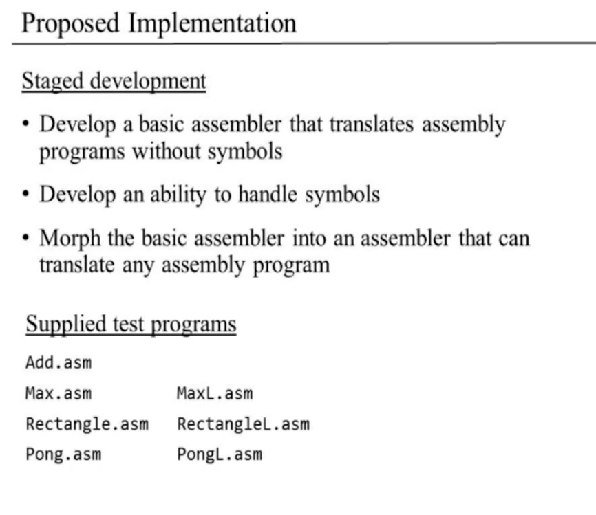

<!-- $theme: gaia -->
<!-- $size: 16:9 -->
<!-- page_number: true -->
<!-- paginate: true -->

# Marp for VS Code スライドサンプル

**_@gonkunkun_**

---

## 目次

- assembler とは
- hack aseembly の復習(長い道のり)
- 一般的なアセンブラーの話と hack ではどうかという話(いらない気もするがあったのでやった)
- hack assembler の話
- 課題の話

---

## アセンブラー

- 機械語のコードを実行できるコンピュータを作りました。
- アセンブリ言語でプログラミングをしてました、
- その隙間にアセンブラを作りましょ。
- 初めてのソフトウェアですよ（ついに）

---

## アセンブラー図

---

## アセンブラーをどこで実行するか

- クロスコンパイルするぜ

* アセンブラをマシンコードで書かなくて良い(多分そういうこと)
* 別のコンピュータですでに実装されている高レベルの言語で書くことができる

---

## 俺たちの Hack assembly どんなんだっけ

- 任意のコードを変換しないといけない（それはそうだがむずそう）
- 両方の文法を知らないといけないよね
- Hack aseembly は A 命令 C 命令 symbol によって構成されているぜ

---

## 3 つ の Register

---

## Hack assembly

---

## A 命令

### Assermbly 文法

- @で始まり、
  - 非負数の 10 進数で表される ex. @20
  - シンボルで表される ex. @tmp

A レジスタに 15 ビットの値を設定するために使える.つまり、特定の値を A レジスタに値を設定することができる

---

## A 命令

### できること

1.  A レジスタを用いて定数を代入する方法(プログラムによって定数を代入する方法は A 命令以外できない)
2.  メモリ操作に使う(A レジスタにメモリアドレスを指定することでその後に続く、C 命令に置いて、A レジスタでしたいしたメモリ位置にあるデータを操作することができる)
3.  その後に移動するための C 命令を用いることで、jump するアドレスを指定するすることが できる

メモリを操作する前には A 命令をする必要がありますよ

---

## A 命令

---

## A 命令

---

## A 命令 シンボルでかくと　 binary 文法

---

## C 命令

---

## C 命令

基本的にやりたいこと

- 計算の結果をどこに保存するか、
- ジャンプするかどうかを決めるかどうか

c 命令と A 命令を一緒に用いることで、コンピュータで行う全ての命令を実行すること ができる

---

## C 命令

- destination、computation、および jump の領域で構成されるよ
  

---

## dest のれい

---

## Comp 領域の仕様

- 7 ビットされるコマンドを実行するができるぜ
- destination、computation、および jump の領域で構成されるよ
- assembly ではこんな感じで表現されるぜ
  

---

## jump

---

## JMP 領域の仕様

- 3 ビットで表現されるぜ
  

---

## c 命令　のれい

---

## c 命令　のれい

---

## c 命令　のれい

---

## C 命令

- ３つの要素で構成されている
- string processing でできるよ
- テーブルから対応している binary を見つけてこよう
- 高級言語で 0 と 1 のテキストファイルを吐き出して、それをパソコンに読んでもらおう

---

## A レジスタの衝突

- A レジスタは c 命令においてデータメモリの位置を指定するのに使う(M と一緒に使う)
- A レジスタは c 命令によって命令メモリの位置を指定するのに使う(jump と一緒に使う)

jmp をする C 命令において M を参照するべきではない

---

## シンボル

---

## handleing symbols

- symbols を使った方が抽象化されたコードをかけるので、
  よりよ安いコードかけるのでいいですよね

  

---

## symbol 使う理由

- プログラマはこれらが実こにあるのかを全く気にしなくて良い

-　シンボル使わないと数字ガチ打ちのけい

- assermber ではこのアドレスの割り当てをやってあげないといけない

---

## symbol2 ラベルシンボル

- もう一つの種類のシンボルは、goto コマンドの目的地を表すラベルシンボル。この例では、LOOP、STOP、END の 3 つのシンボルがある。

---

## symbol3 -定義済みシンボル

復習終わり

仮想レジスタ、スクリーン、キーボードなど、定義済みシンボル。
例では、 R0 と R1 がそうである

---

## 一般的にアセンブリーをどのように読んでいくか

1. ファイルを上から下に読んでいくが、スペースとかコメントは無視するようにする

---

## step 2 要素ごとの分割

- string を要素ごとに分ける
  

---

## step 3 対応するバイナリーを探す

- それぞれの要素を読み込むぜ
- それに対応する binary に書き換える
  

---

## step 4 一つの bainary にまとめて出力する

- これでプログラムは実行することができるようになる
  

---

## シンボル　どうする問題

- ラベルシンボル
  - ユーザが定義するシンボルであり、プログラムの特定のアドレスにジャンプするための変数(goto に使われる)
- 変数シンボル
  - ユーザ定義したシンボルの中で、事前に言語に定義されておらず、かつ ラベルシンボルで定義されてない奴、それは変数として扱われ、このシンボルはアセンブラによって一位のメモリアドレスが与えられる。

---

## シンボルどうする問題

---

## シンボル　テーブルや

---

## 変数シンボルのアロケーション

- 使えるメモリを探す
- その値を symboltable に保存していく
  

---

## ラベルシンボルどうする問題

- ラベルは実行するコマンドではない。
- ループとかで呼ばれるので、アドレスを覚えている必要がある
  

---

## ジャンプが先呼ばれるとどうする問題

---

## 俺たちの Hack ではどうするの

- 全ての assembly で動かないといけない
- なんか難しそう
  

---

## A 命令

---

## C 命令

---

## シンボル

---

## アセンブラーで対処しないといけないこと

- インデントとかコメントとか無視しないといけなさそう
- 命令を対処する
  - A, C 命令
- シンボル
  - 変数、ラベル

シンブルの実装が難しそうなので、とりあえずシンボルなしのケースを考えます

---

## シンボルないとこんな感じですな

1. whitespace
2. 命令
   

---

# whitespace

- ただただ、コメントの empty line はアセンブラーで無視するようにしましょう
  

---

# 命令

---

## A 命令の翻訳

- ＠十進数のプラスの値だったら、二進数に変換する。
- 15 ビッドで表現されるので、足りないところは 0 でうめる

- symbol の場合もありますが、それはまた後で考えましょう
  

---

## C 命令の翻訳

- C 命令は 3 つの coponent で構成されるので、それぞれの対応を考えていきましょう
- dest が empty であれば =は省略
- jump が empty であれば ;は省略

string processing でできるということ

---

## aseembly 基本戦略

symbol ない奴はこれで動く

---

## symbol 三種類

---

## Handlling pre defined symbol

- 定義された記号を、対応する値（10 進数）に置き換える
- 10 進数を 2 進数に置き換える（それはさっき話した）
  

---

## Go to の symbol どうするねん

- プログラムの中で goto コマンドを使ってジャンプしたい場所を表すために使う
- (ラベル名)　()で囲まれてたら symbol ですね
- プログラムの中で XXX が出てきたときには、メモリのアドレスに置き換える
- 命令番号を記録
  アドレスに置き換えていきましょう
- @LOOP -> @4 になる

ex.

---

## Symbol table predefined symbol

- これは A 命令にしか存在しません
- 23 この predefined symbol がありますが、
  これに対応する数字を二進数に変換しましょう
  

---

## ラベルシンボル

- go to の　行先のアドレスを表すラベルとして使われる
- これはコードを生み出さない（アドレスを保持する必要があるだけなので）
- ()で始まるで（）で始まるのには理由があるらしい
- @Loop とかを　＠４と変換しなくてはいけない
  

---

## 変数シンボル

- predefined にもなく()のなかにない@は変数シンボルである
- それぞれの変数 16 ビットのユニークなアドレスが振られる
- 値は 16 から始まります。

---

## symbol table で管理しよう

- シンボル（ラベル名）とアドレスのペアを管理しましょう

first loop

0. predefined のやつを追加しましょう
1. ラベル変数を追加しましょう
   （ライン番号を数えながら、）

   

---

# Symbol table3

second loop

- この時点で symbol-table にない奴は symbol だ
  

---

# アセンブラのアルゴリズムの解法

---

# アセンブラのアルゴリズムの解法

1. 最初に入力ファイル全体を調べて、左の括弧で始まる命令を検索します。そして、そのペア、xxx、アドレスをシンボルテーブルに追加していきます。
2.

---

<!-- # omake

- 入力を読み込んで、分割していこう
- 指定されたファイルを読み込んでいこう
- 読み込んだファイルの次のコマンドを毎回取得できるよう
- 読み込んだコマンドをコンポーネントに分割していこう
  

--- -->

<!-- # 実装方法

頑張ろう

--- -->

<!-- # 実装方法

どんなコマンドなんだろう

--- -->

<!-- # C 命令のやり方

--- -->
<!--
# symbol table

--- -->

<!-- # symbol table

--- -->

# 実装の提案

---

# project の概要

---

## project の概要

---

## project の概要

---

project の概要

---

# まとめ

- hack.aasm ファイルが与えられる
- 上からそれぞれのラインを読んでいき
- それが A 命令 ならば - 十進数の値を二進数に変換する
- C 命令 ならば、それぞれの値を 3 つの component にわけて処理をしていこう

最後にこれら全てをまとめる - 各行は 16 個の 0 と 1 の文字列で構成される - 記号のない A 命令と C 命令だけで構成されたプログラムが完成

- 最後にそれをファイルとして書き出しましょう

---

Add

---

Add

---

# pong

https://youtu.be/0y8JPx0ZakY?list=PLrDd_kMiAuNmSb-CKWQqq9oBFN_KNMTaI&t=1170

---

おしまい

---
