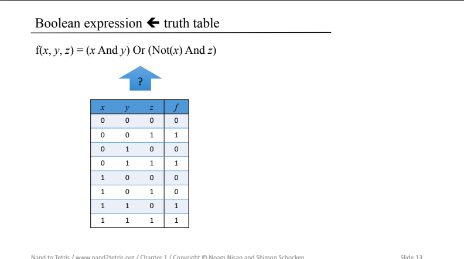
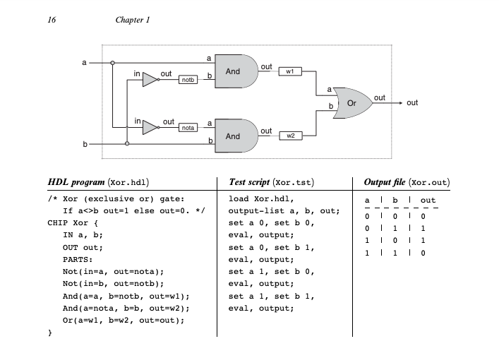

<!-- $theme: gaia -->
<!-- $size: 16:9 -->
<!-- page_number: true -->
<!-- paginate: true -->

# コンピュータシステムの理論と実装

<!-- ***@gonkunkun*** -->

---

## もくじ

1. Intrduction
2. 使い方
3. ユースケース

---

## 1. Intrduction

- コース概要 - https://www.nand2tetris.org - course https://www.coursera.org/learn/build-a-computer/lecture/tfRns/
  unit-0-0-introduction - ted talk - moden pc を自分で一から作ってみようといコンセプト
  

---

## Intrduction

- 最近話題のライセンス - https://www.nand2tetris.org/licens

---

##　背景

- バソコンは全て情報の保存と処理を行うために設計された **論理ゲート(logic gate)** から構成されている。
- 本章では,　**ブールゲート(boolean gate)** と呼ばれる最も単純なゲートに焦点をあてる。
- ブールゲートは **ブール関数(boolean function)** を物理的に実現したもんであるため、ブール関数についてみます。

---

## ブール代数

- ブール代数はブール値を扱う(0, 1)のみ
- ブール関数はブール値を受け取り、ブール値を返す関数
- ブール関数を表現する方法 -　真理値表(truth table) -　ブール式

---

## 真理値表(truth table)

- 全ての入力に対数る関数の出力を全て列挙する
- 変数の組み合わせは $2^3$ 通りある
- 真理値表から **ブール式(boolean expression)** を導くことができる
  

---

## ブール式(boolean expression)

- ブール式の基本は $And$, $Or$, $Not$の 3 である
  

---

## ブール式(boolean expression)　例

---

## ブール式(boolean expression)　

- $f(x, y, z) = (x + y)*\tilde{z}$
  

---

## ブール式(boolean expression)　

---

## ブール式(boolean expression)

---

## ブール式(boolean expression)

---

## ブール式(boolean expression)　

---

## 雑談 shano おじさん

---

## ブール式(boolean expression)　

---

## ブール式(boolean expression)　

---

## 正準表現

---

## 正準表現

---

## 正準表現

---

## Nand

- $And$の Not
  

---

## Nand

---

## 入力のブール関数

- - n 個のバイナリに対するブール関数$2^{2^n}$このブール関数が定義される
    

---

## 1.1.2 論理ゲート

-　 gate はブール関数を実装するための物理ディバイスである。

- $n$個の入力に対して$m$のバイナリを返す$f$を考えた場合、それを実装するゲートは n 個の入力ピンにと m 個の出力ピンを持つことになる。
- このようなゲートも単純なゲートを組み合わせることで構成することができる。
- ブール代数はいかなる技術を使ったとしても抽象化で切ることを表している
- ブール代数と抽象化されたゲートについてのみ考えればよく、ハードウェアについては、プロに任せよう

---

## 基本ゲートと複合ゲート

---

## 基本ゲートと複合ゲート

-　$And(a, b, c)$　の実装を考える

- $a * b * c$　とブール代数を使うとかける
  

---

## Xor のれい

- $Or(And(a, Not(b)),And(Not(a),b))$　とかける

## 

## つまり

- インターフェースは一つしか存在しないが、実装方法はたくさんある
- なるべくゲートが少なくなるように実装しましょう

---

## 1.1.4 　ハードウェア記述言語(HDL)

- これらのゲートを実際に作りたい - 大変そう
- HDL を使って回路を設計しよう - テストが簡単 - hardware simulator を使って HDL で書かれたプログラムを入力として読み込み、メモリ上にそのプログラムで指定された回路を表現する。 - その回路に対してテストを走らせて動いてるかどうか確認する

---

## 1.1.4 　ハードウェア記述言語(HDL)

---

## ハードウェアシュミレータをダウンロードしよう

TODO

---

## 課題

---

## Nand

---

## Not

---

##

---

## MUX

---

## DMUX

---

## 多ビットの基本ゲート

- コンピュータのハードウェアはバスと呼ばれるタビットの配列を操作するように設計されているのが一般的である
- 16 ビットのコンピュータを作るので 16 ビットの入力

---

## 多ビットの基本ゲート

---

## 多ビットの基本ゲート

---

## そのた

---

## そのた

---

## そのた

Good luck

---
