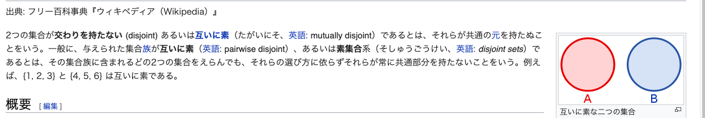
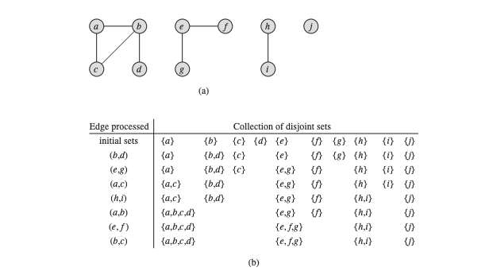
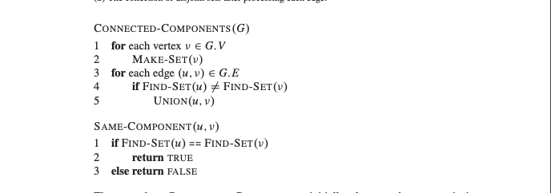
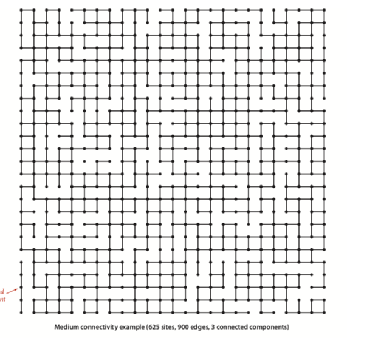
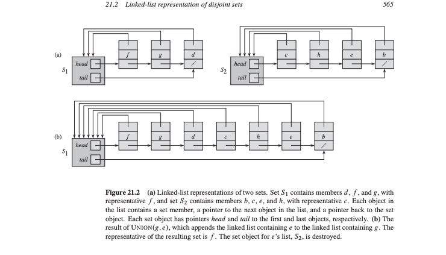
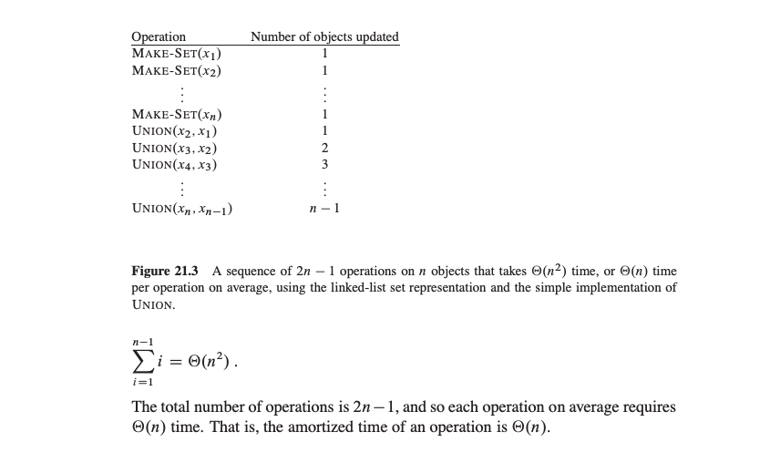
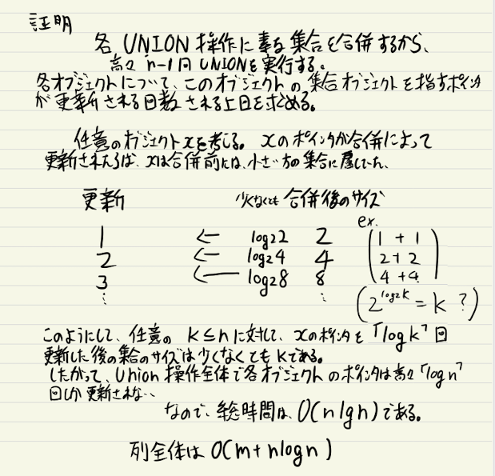
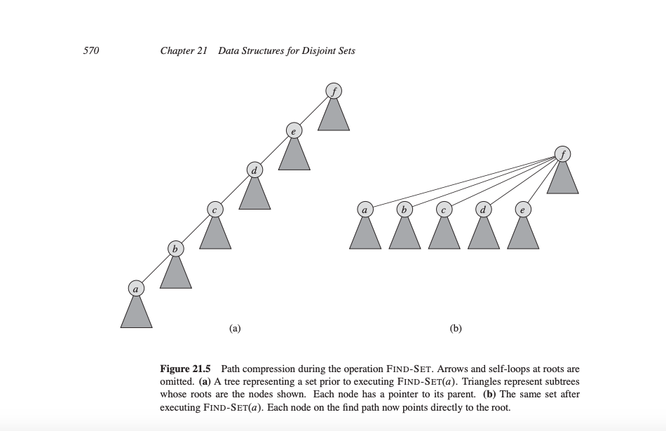
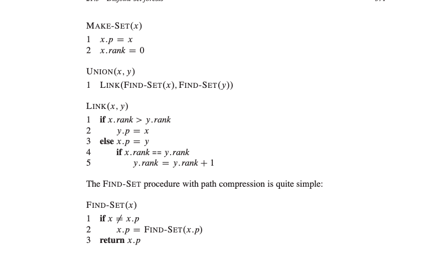

# 21 互いに素な集合族のためのデータ構造

---

## 概要

互いに素なグループに属する n 個の異なる要素を扱いたい。

- 指定された要素が所属する集合を求める操作 {.fragment .fade-left}
- 二つの集合を合併する操作 {.fragment .fade-left}

---

## 各章

- 21.1 利用できる操作と、簡単な応用例
- 21.2 互い素な集合族の単純な連結リストによる実装 (配列)
- 21.3 根付き木による実装
- 21.4 経路圧縮を用いるランクによる合併の解析 {.fragment .fade-out}

---

## 互いに素な集合族の操作

互いに素な集合族のためのデータ構造は互いに素な動的集合の族
\[S={S1, S2,...,Sk}\]を管理する
各集合のその集合の代表元と呼ばれる元によって識別する。

---

## 互いに素な集合族の操作

- MAKE-SET(x) x を唯一の要素としてもつ新しい集合を生成する
- UNION(x, y)
- FIND-SET(x) を含む(唯一の)集合の代表元の要素を返す

---

## 計算量の基本方針

- MAKE-SET 　操作の実行回数 n と　 MAKE-SET, UNION, FIND-SET 　操作のそう実行回数を m とする
  Union 操作の回数はたかだか n-1 である。
- n 回の MAKE-SET 操作は他の操作に先立って実行されると仮定する。
  

---

## 互いに素な集合族のためのデータ構造の応用例

無効グラフの連結成分を求めてみよう

---

## 互いに素な集合族のためのデータ構造の応用例

---

## 21.2 連結リストによる互いに素な集合族の表現

---

## 21.2 連結リストによる互いに素な集合族の表現
- 各集合を連結リストで表現する。
- 各リストに対するオブジェクトは、リストの最初のオブジェクトへの参照をもつ。
- MAKE-SET(1) FIND-SET(1)
- Union は大変そう

---

## 21.2 連結リストによる互いに素な集合族の表現

---

## 重み付き合併戦略
- 最悪の場合、一回の呼び出しに平均Θ(m)かかる。
- 短いリストに長いリストを継ぎ足すパターンが遅い
- 長さを管理して常に短い方を継ぎ足そう

---

## 定理21.1
- 最悪の場合、一回の呼び出しに平均Θ(m)かかる。
- 短いリストに長いリストを継ぎ足すパターンが遅い
- 長さを管理して常に短い方を継ぎ足そう

---

## 証明　お気持ち

---

## 21.3 互いにソナ集合の森
- 互いに素な集合族を根付き木の森を用いて表現しよう
- 互いにソナ集合の森は、各要素は、その要素の親を指すポインタを持つ
- 各木の根は代表元を含み、自分自身が親。
- ランクによる合併と経路圧縮すると早くなるらしい

---

## 21.3 互いにソナ集合の森
- Make Set　は単一の接点から構成される木を作る
- Find-Setは　木の根を見つけるまで、親のポインタを登れば良い

---

## 改善の戦略
- ランクによる合併
- 経路圧縮

---

## 経路圧縮

---

## 疑似こーど
- make set rank0で初期化
- union
  - rankが違う場合は、ランクが低い根の親を高いのにする(この際ランクは変えない)
  - ランクが同じ場合は、任意のを親にしてランクを増やす

---

## 疑似こーど

---

## 解析
- ランクによる合併でO(mlgn)
https://www.youtube.com/watch?v=i7sm9dzFtEI&t=347s

---

<!-- ## 効果

大きくする {.fragment .grow}

小さくする {.fragment .shrink}

フェードアウト {.fragment .fade-out}

右フェード {.fragment .fade-right}

上フェード {.fragment .fade-up}

下フェード {.fragment .fade-down}

左フェード {.fragment .fade-left} -->
