[Slide link](https://d3c33hcgiwev3.cloudfront.net/_fd8526e76d29a6985ca393724086512e_32BinarySearchTrees.pdf?Expires=1572566400&Signature=Am3MInGoHddLTeeFX2R0r6tPj9jOj3iS91wf7cCHK1ilgouMt0zkCdJ~mhpdnuoz7E9bfwm3MovZfjQsNadbMsvV9DPDFDjWhtQfCLCeDoq20kEV0R~3NNXIwXmAui83eqU52iVBdxqgKB2PqicF-tMtTLy1dkmcFEDDpIj9Yo8_&Key-Pair-Id=APKAJLTNE6QMUY6HBC5A)
# Intro
We introduce in this section a type of binary search tree where costs are guaranteed to be logarithmic. Our trees have near-perfect balance, where the height is guaranteed to be no larger than 2 lg N.

2-3 search trees. The primary step to get the flexibility that we need to guarantee balance in search trees is to allow the nodes in our trees to hold more than one key.
Definition. A 2-3 search tree is a tree that either is empty or:
A 2-node, with one key (and associated value) and two links, a left link to a 2-3 search tree with smaller keys, and a right link to a 2-3 search tree with larger keys
A 3-node, with two keys (and associated values) and three links, a left link to a 2-3 search tree with smaller keys, a middle link to a 2-3 search tree with keys between the node's keys and a right link to a 2-3 search tree with larger keys.

* Review   
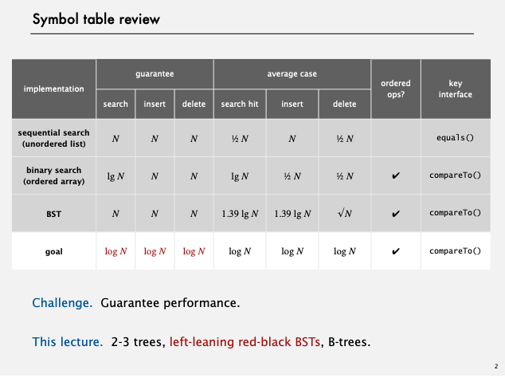

[RANDOM INSERTION](https://youtu.be/vWchQ0Di7yM?list=PLRdD1c6QbAqJn0606RlOR6T3yUqFWKwmX&t=941)
[RANDOM INSERTION and Deletion](https://youtu.be/6zoBvuPk510?list=PLRdD1c6QbAqJn0606RlOR6T3yUqFWKwmX&t=414)

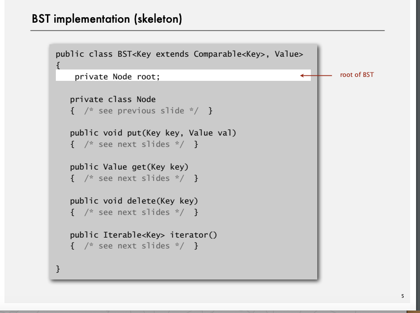
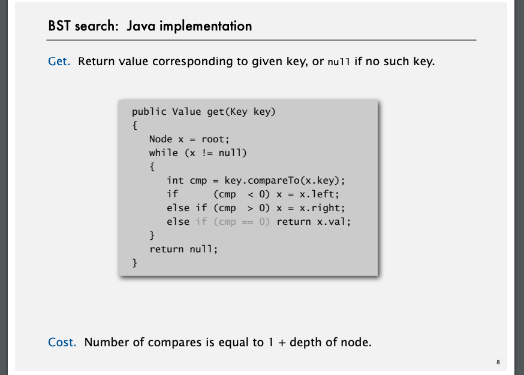
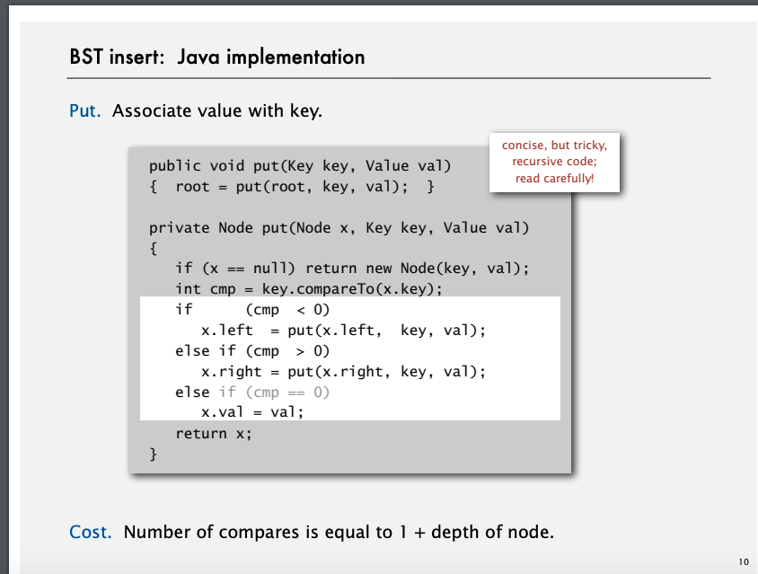

* TODO 定義を日本で書く  
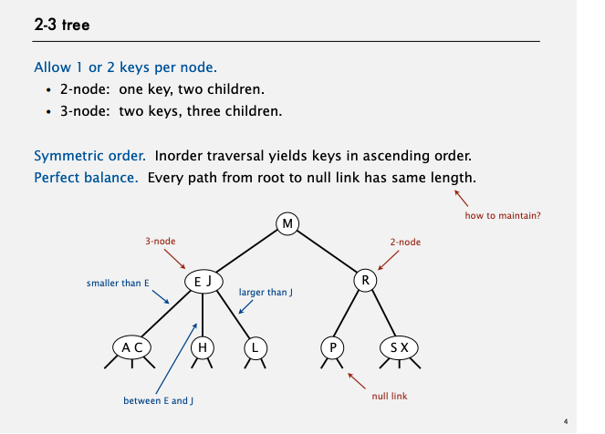

*　挿入　ケース1  
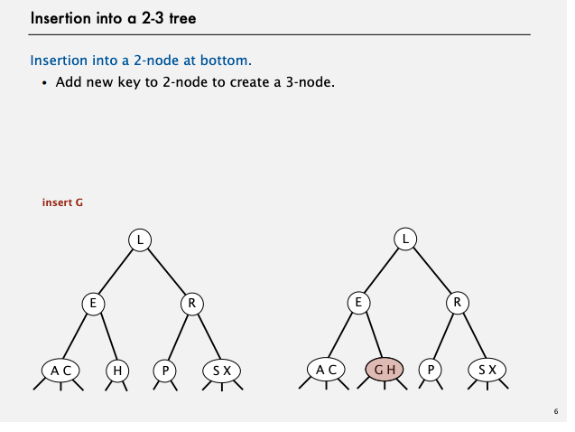
* ケース2
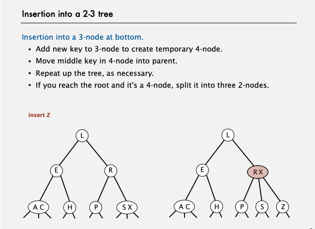
[DEMO](https://youtu.be/N-yla7zw0Fw?list=PLRdD1c6QbAqJn0606RlOR6T3yUqFWKwmX&t=197)
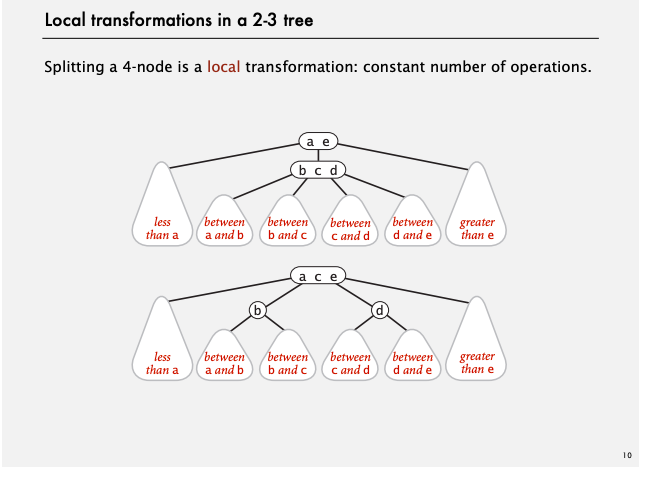
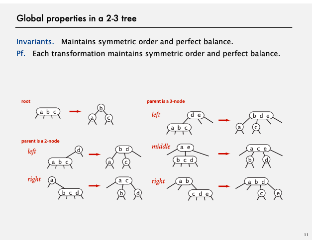

まとめ  
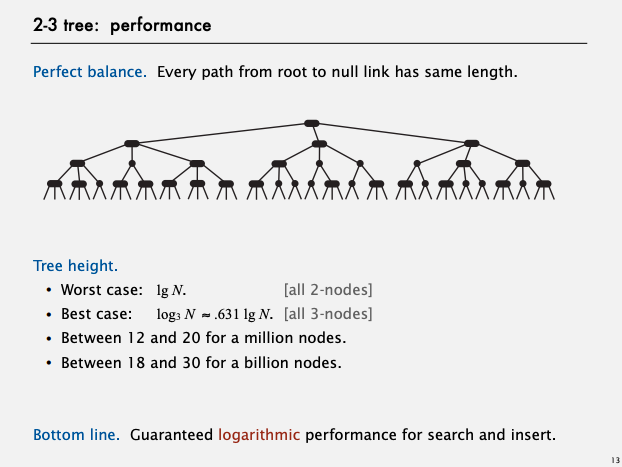
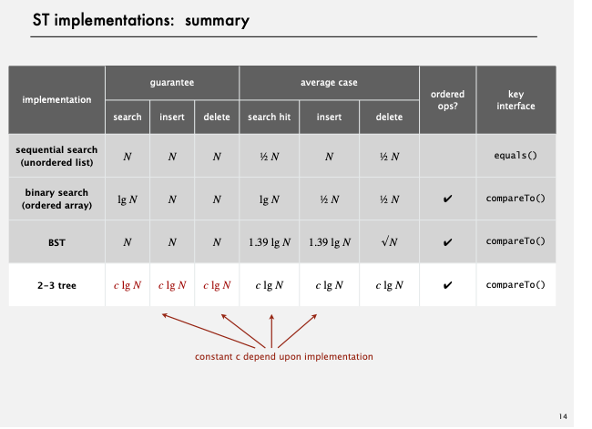

* みんな大好きRed Black tree  
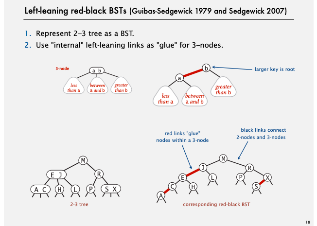
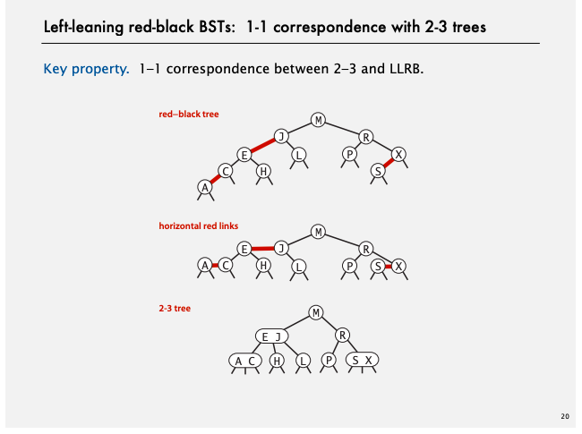
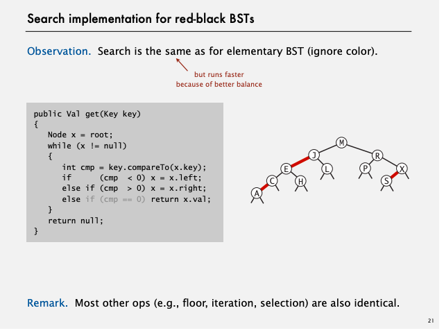
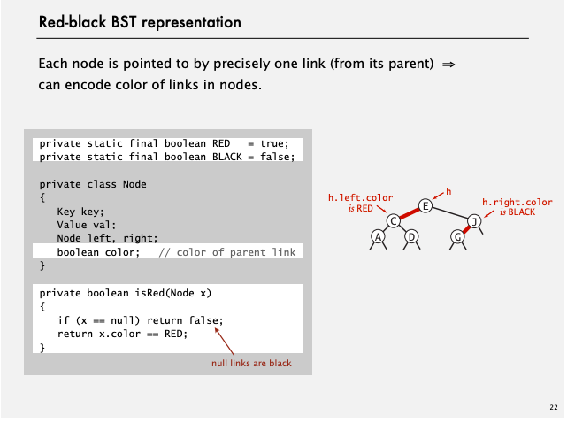
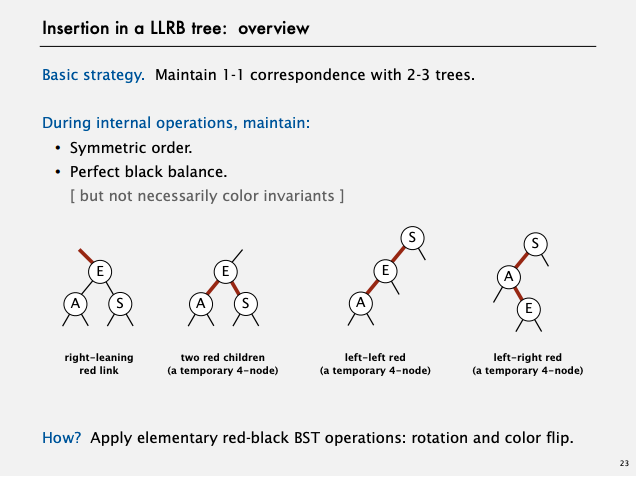

https://youtu.be/8HVMaEqQJDU?list=PLRdD1c6QbAqJn0606RlOR6T3yUqFWKwmX&t=452

* 回転２  
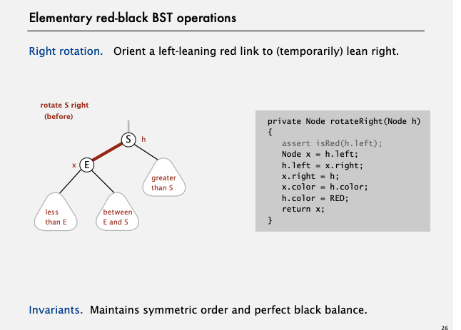
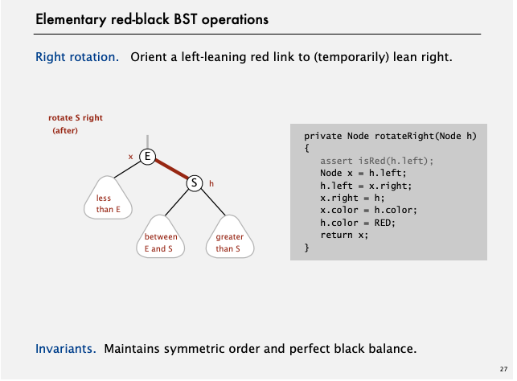
https://youtu.be/8HVMaEqQJDU?list=PLRdD1c6QbAqJn0606RlOR6T3yUqFWKwmX&t=452
* 色変換  
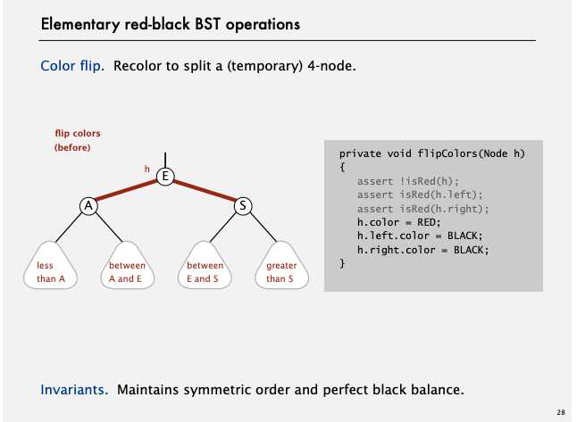
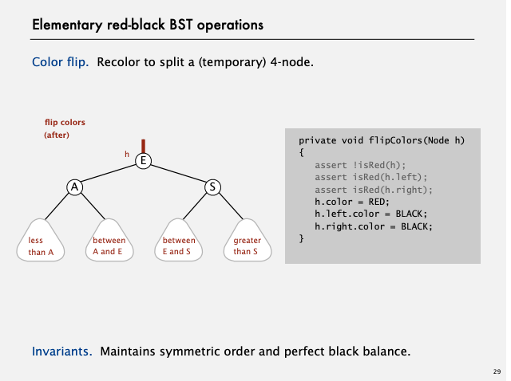
https://youtu.be/8HVMaEqQJDU?list=PLRdD1c6QbAqJn0606RlOR6T3yUqFWKwmX&t=681

* Insertion case 1  
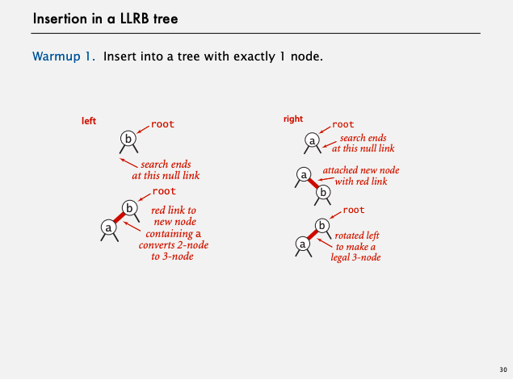
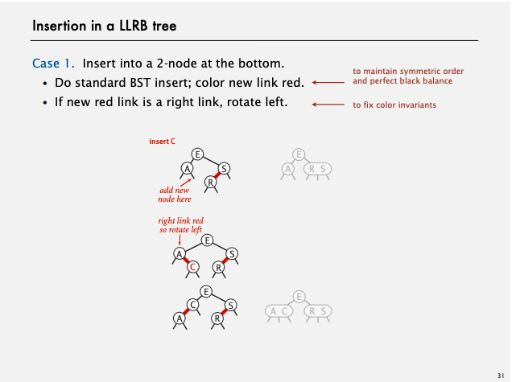

* Insertion case 2  
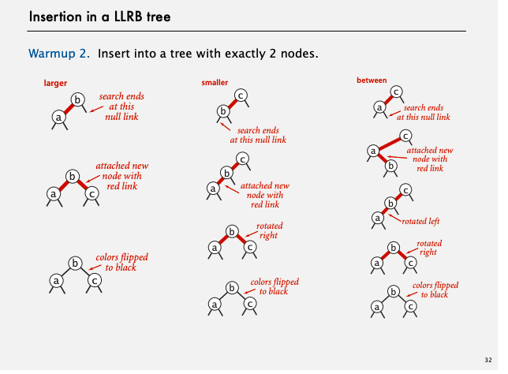
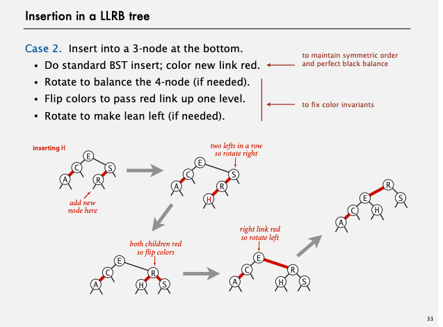
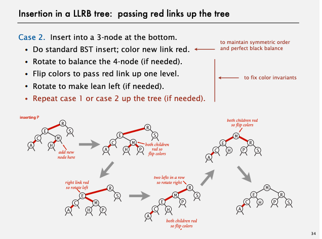

https://youtu.be/8HVMaEqQJDU?list=PLRdD1c6QbAqJn0606RlOR6T3yUqFWKwmX&t=1242
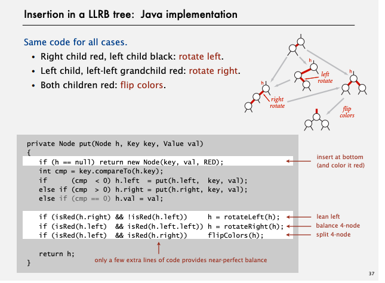

https://ja.wikipedia.org/wiki/%E3%83%91%E3%83%AD%E3%82%A2%E3%83%AB%E3%83%88%E7%A0%94%E7%A9%B6%E6%89%80
 * TODO 削除

[DEMO](https://youtu.be/8HVMaEqQJDU?list=PLRdD1c6QbAqJn0606RlOR6T3yUqFWKwmX&t=1695)
 * 最後のまとめ  
 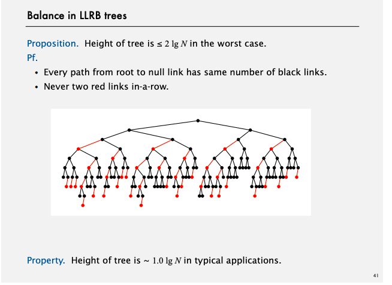
 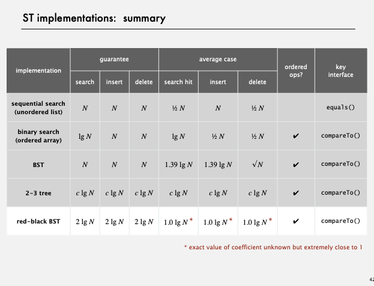

 https://github.com/reneargento/algorithms-sedgewick-wayne/blob/master/src/chapter3/section3/Exercise24_WorstCaseForRedBlackBSTs.txt

[研究所](https://ja.wikipedia.org/wiki/%E3%83%91%E3%83%AD%E3%82%A2%E3%83%AB%E3%83%88%E7%A0%94%E7%A9%B6%E6%89%80)
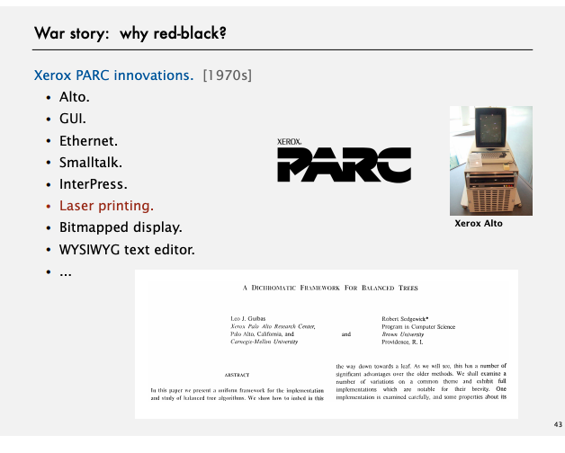