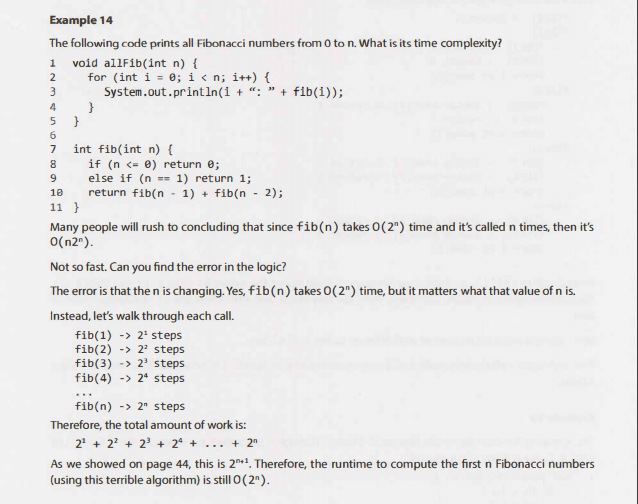

<!--  -->

[元リンク](http://faculty.washington.edu/pisan/cpp/readings/McDowell_ch6_Big_O.pdf)

## Amortized Time　（ならし解析）

199 page
http://www.albertstam.com/Algorithms.pdf 

一緒に実装してみよう

## 再帰関数
[Demo](https://youtu.be/Mv9NEXX1VHc?t=291)  
実際に書いてみよう

<!-- 
.png)

## Log n

## Recursive

	

## Example1

## Example2

## Example3

## 解説

## Example5

## Example6

## Example7

## Example8

 ## Example9
 

 ## Example10
 

  -->