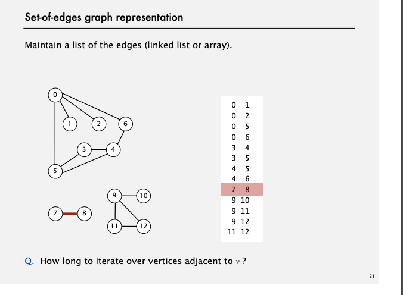

# Graph

## はじめに　　
* グラフは様々なことに応用できるよ

## APIの定義
```
Graph(int V)

void AddEdge(int v, int w)
Iterable<Integer> adj(int v)
int V()
int E()
```
=100x
## 隣接の表現
* 辺の配列を作る 


* 隣接行列を使う  
  

* 隣接リスト  


* 実際のアプリケーションでは隣接リストを使うことが多い　　

  

* グラフって最大で何このEdgeをつけれるのだろう  
Coding してみよう
隣接行列と、隣接リスト両方を実装してみよう

## パフォーマンス


## 迷路の表現


[参照](https://algs4.cs.princeton.edu/lectures/41UndirectedGraphs-2x2.pdf)