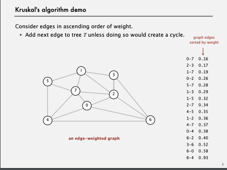
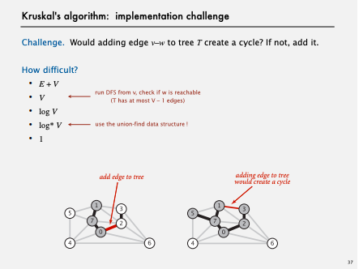
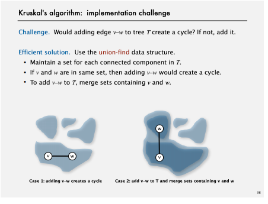
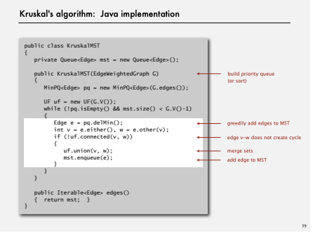

# MST(最小全域木)

## 方針
* 辺の重さを小さい順に並べる
* その辺を加える際に閉路を作るか確認しつくらないのであれば追加

[Animation](https://visualgo.net/en/mst)
[Animation2](https://youtu.be/0pZ8PB-Zfe4?list=PLRdD1c6QbAqJn0606RlOR6T3yUqFWKwmX&t=140)

## 計算量

