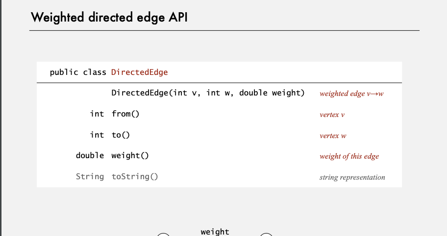

# ダイクストラ (Dijkstra)

> The use of COBOL cripples the mind. its teaching should, therefore, be regarded as a criminal offense.

COBOLの使用は心を傷つけます。したがって、その教えは犯罪行為と見なされます。

>  object-oriented programming is an exceptionally bad idea which could only have originated in California.

「オブジェクト指向プログラミングは、カリフォルニアでしか生まれなかった非常に悪い考えです。」

# Demo

[Demo1](https://youtu.be/uzHJXbToiIU?list=PLRdD1c6QbAqJn0606RlOR6T3yUqFWKwmX&t=133)

# Edge relaxation

# Dijkstra Algorithm

# priory queue を拡張しよう

# Computing spanning trees in graphs

