#　QuickSort
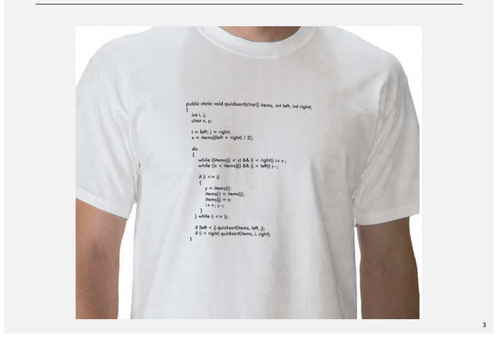

# ソートとは
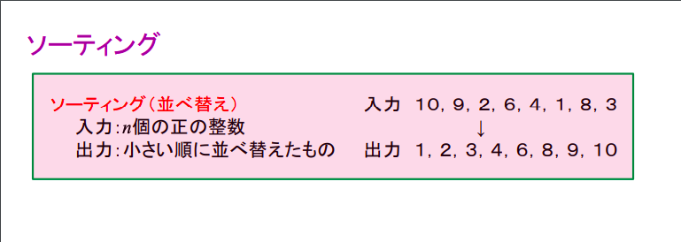

# いいところ
* 実装が簡単
* In Place でできる
* 平均の計算量が nlong

# Demo

708
[Demo](https://www.coursera.org/learn/algorithms-part1/lecture/vjvnC/quicksort)

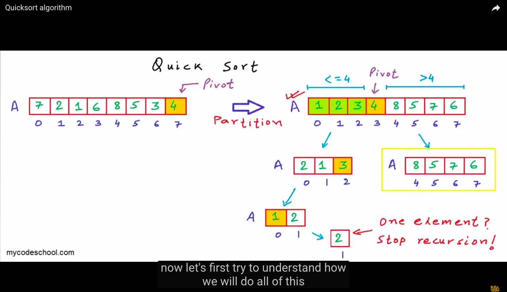

実装例
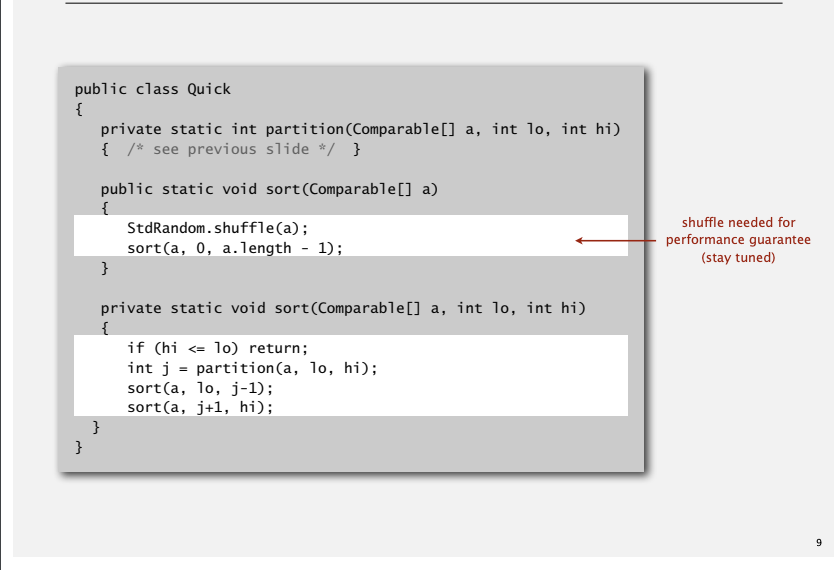
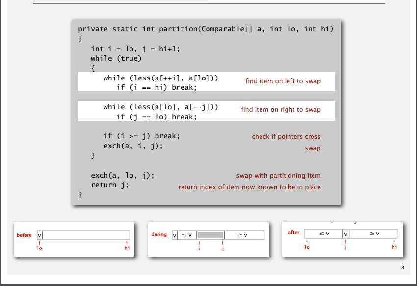

# 計算量
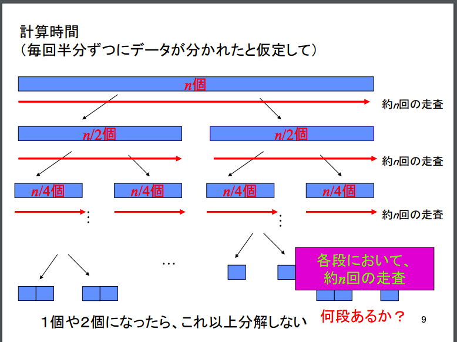
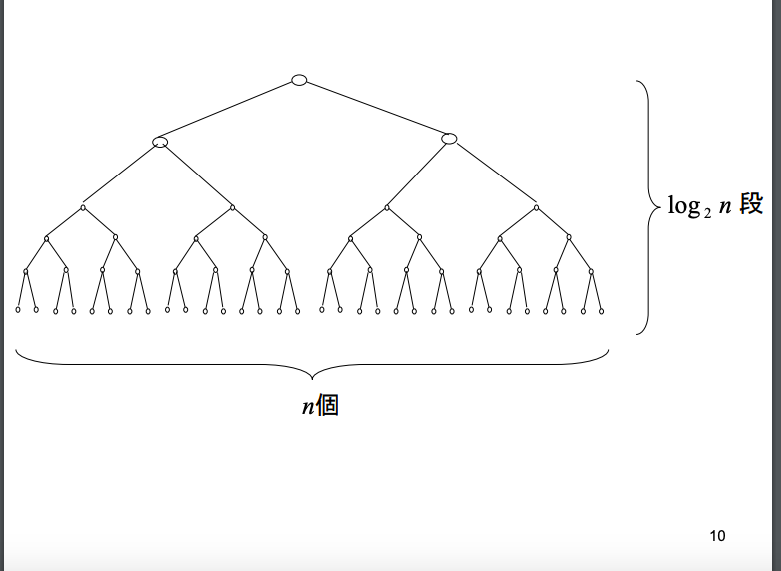

[証明](http://www.e.gsic.titech.ac.jp/~mano/cs2/5/lect2-5.pdf) みんなで考えたい

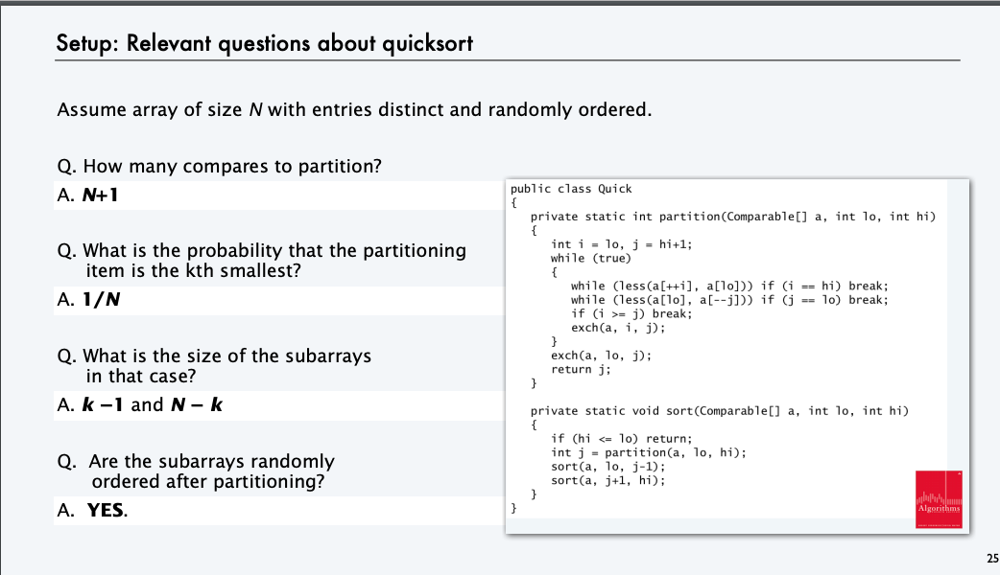
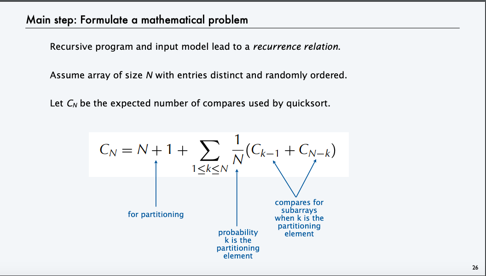
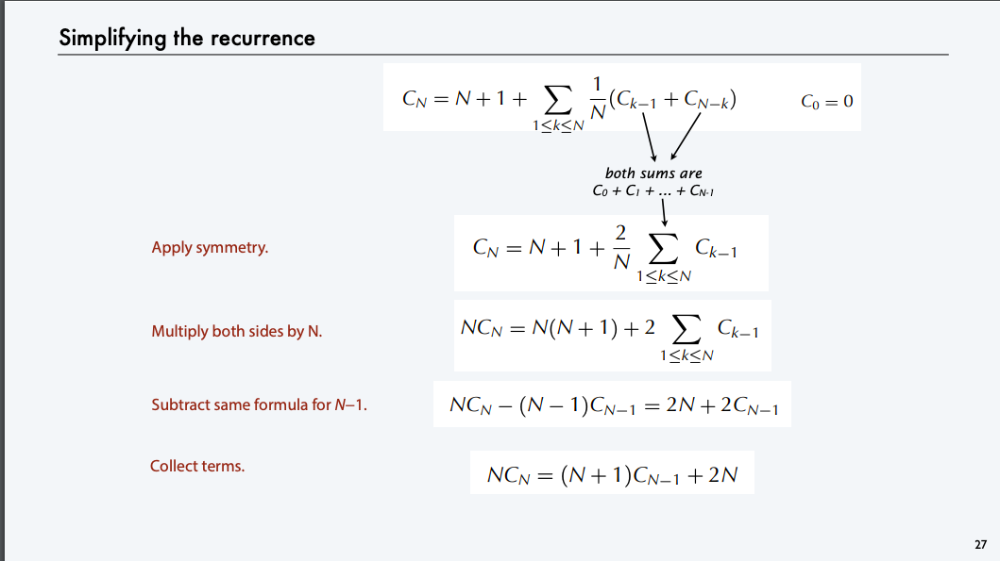
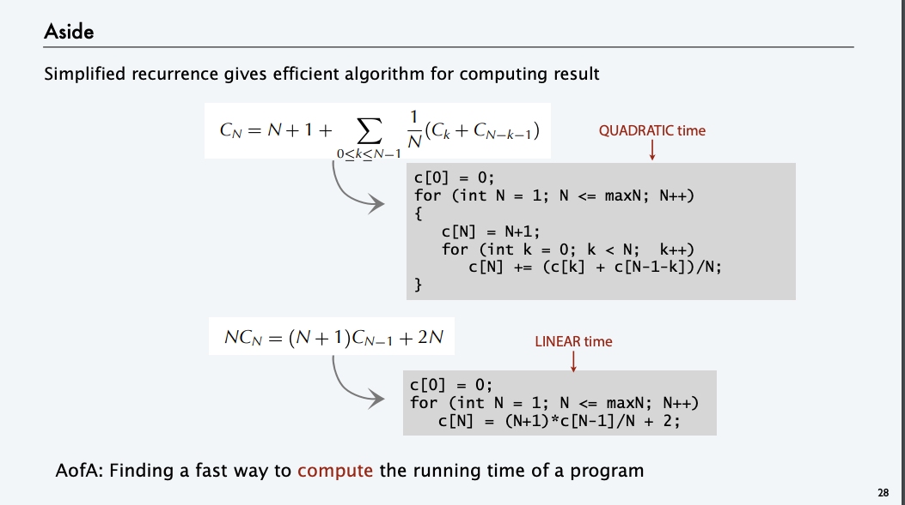
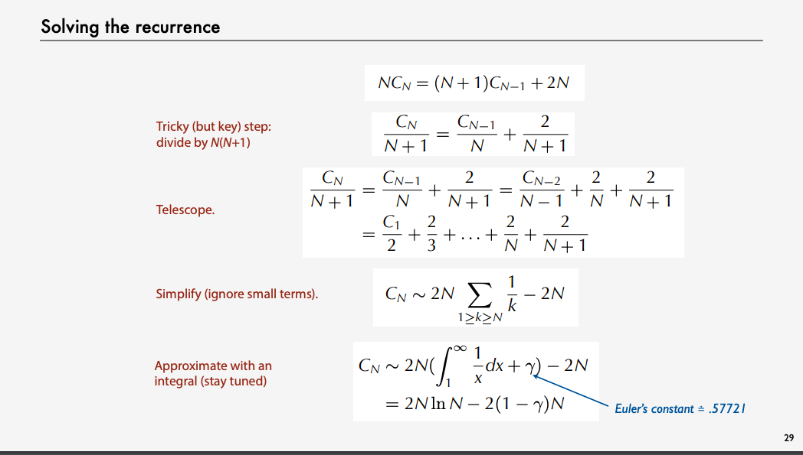
[参照](https://aofa.cs.princeton.edu/online/slides/AA01-AofA.pdf)
# 改善
* 小さいarrayなら insertion sortの方がいい
* partion する前に中央値を求めてその値でやる
# まとめ
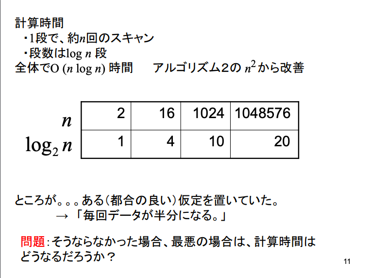