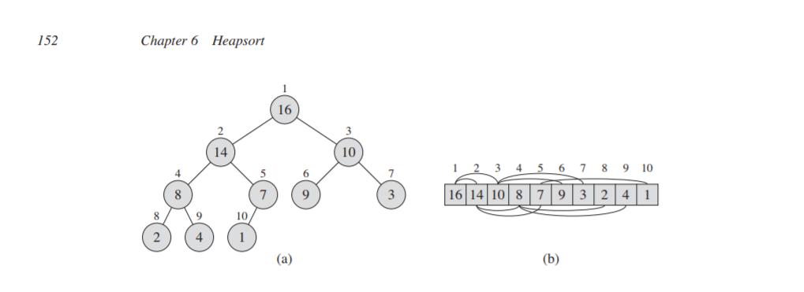

# HeapSort
* 実行時間 `O(nlogn)`
* In place sort
* head データ構造を使って実現する

## 6.1 Heap
* arrayを　'ほぼ完全な二分木' とみなして実装する　　
* 補足　深さが1だけ異なる葉が存在し、その1だけ深い葉が木全体の左側に詰めてあるタイプの2分木も、完全2分木とみなされる。


* array size と　heap size によって定義される

```
Parent(i) return i/2
Left(i) return 2i
Right(i) 2i + 1
```
* Binary heap ->　Max HeapとMin Heap
* ヒープ条件が違うよ

```
Max Heap  A[Parent(i)] >= A[i]
Min Heap A[Parent(i)] <= A[i]
```
 heap sort の例では　Max Heap を使うよ

 * 木としてのHeapSort
 	* 木の高さがΘ(lgn)になる
	* 実行時間はO(lg n)

## 6.2 ヒープ条件の維持
Left(i) とRight(i) がMax heapの条件を満たしていると仮定する。
A[i]　が子供より小さいときに、Max - Heap lify という関数をよぼう  
Extract Max [Demo](https://visualgo.net/en/heap) 
実装すること


+ 計算量のはなし

## 6.3 Building heap
普通の配列を heap に変換しよう  
ループ不変式
i はmaxHeapの根であるあることを仮定する
[Create Demo](https://visualgo.net/en/heap) 

## 6.4 ヒープソートアルゴリズム


