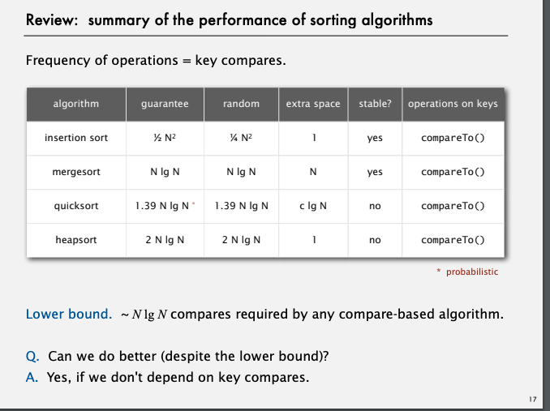
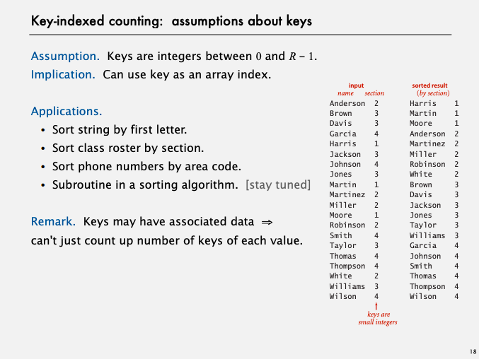
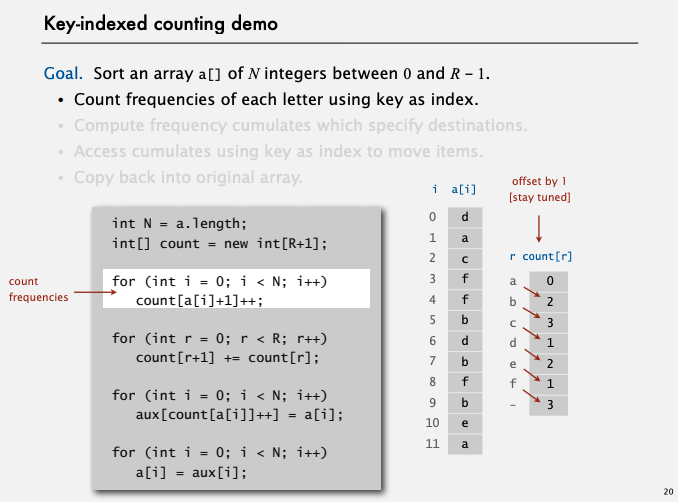
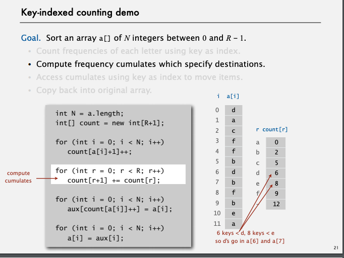
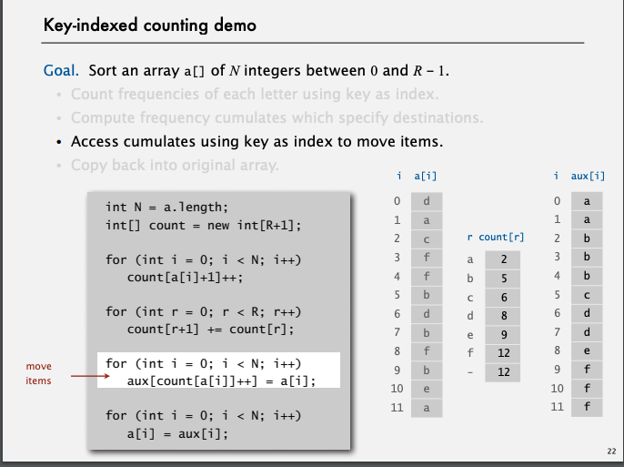
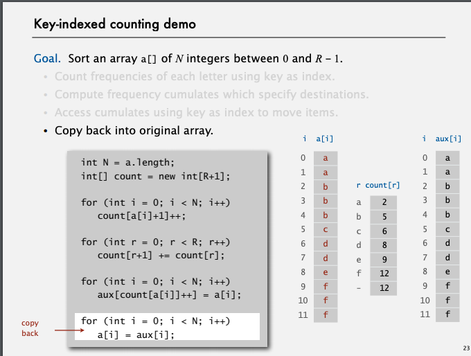
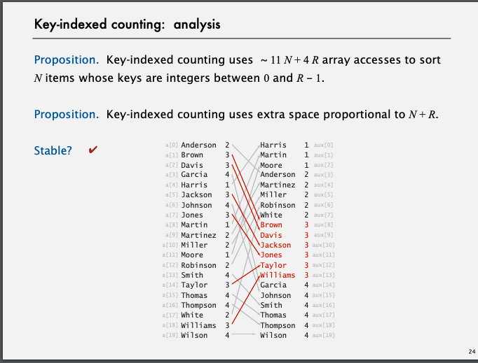

# Counting sort

O(n) stable 値の上限がわかってれば

## analysis

Step1
最初に出てkる数字の上限が必要
countでそれぞれのkeyが何回出てきたか数えるため
count[0] = 一番最初のkeyの値を示しているのである
つまり、countでsortしてるとも言えそう
さらにここでoffsetで一つずらして数える

Step2
count配列を変換する
前の数字を足し合わせていく
これによりcount[i] = i i番目に以下にはいくつ要素があるのかわかる
また　配列は 0から始まるので、その値の一番最初の値がcount[i]番目に入ることもわかる

