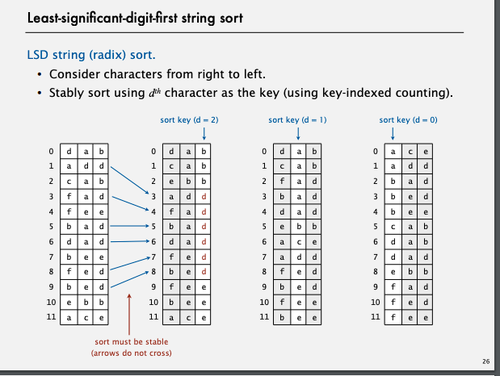
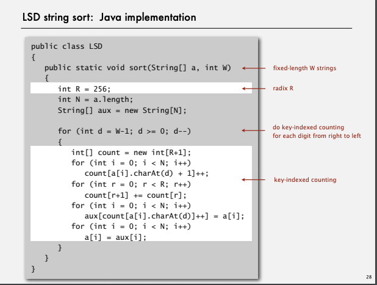
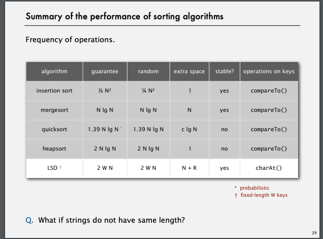
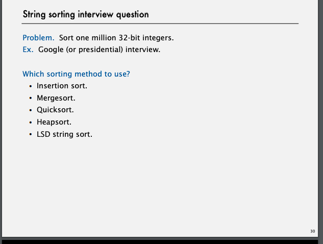

# LSD string sorting (least significant digit)

## 手順
前提　与えられた配列の要素の長さはfixed.
そもそも input として配列が与えられます。
それを後ろから舐めていきます。
それぞれの要素で counting sortをしていきます。

[obama](https://www.youtube.com/watch?v=k4RRi_ntQc8)