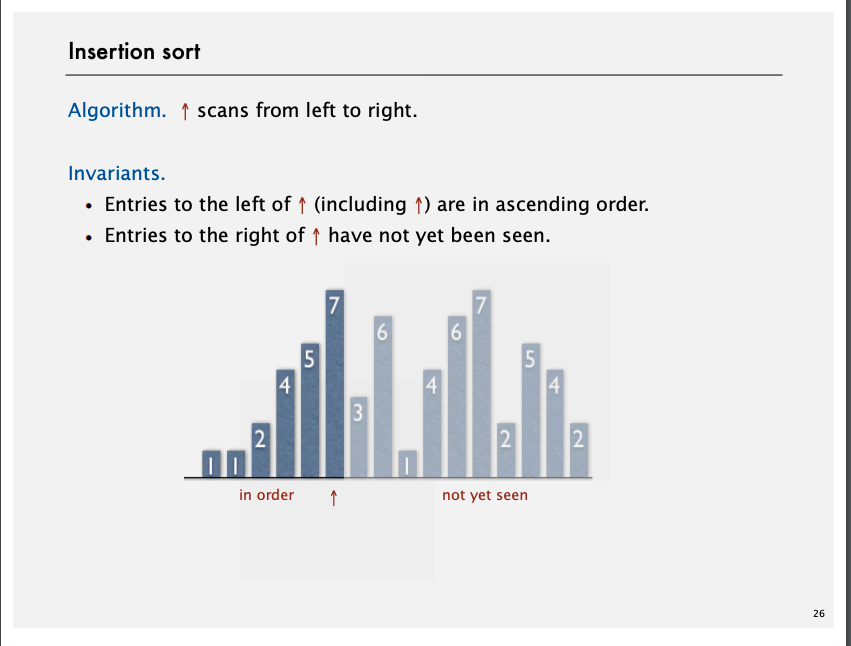
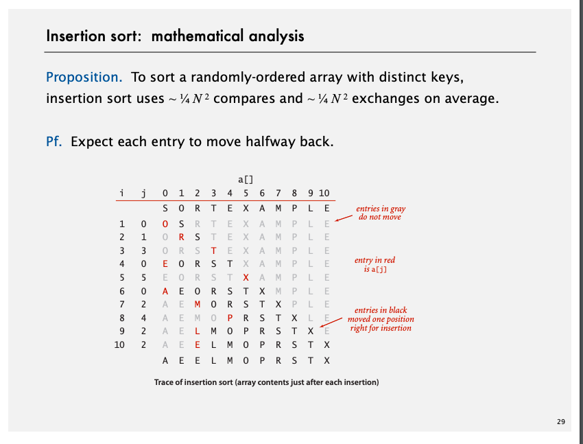
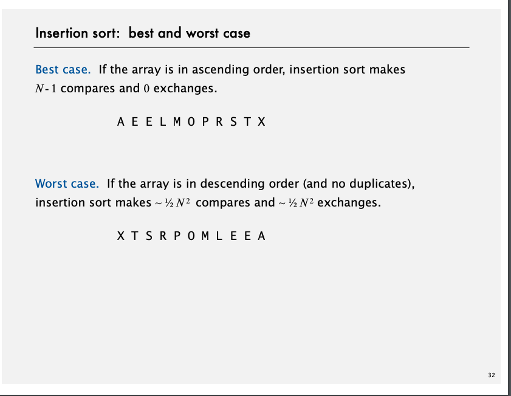

# Insertion Sort(挿入ソート)

```
まず0番目と1番目の要素を比較し、順番が逆であれば入れ換える。次に、2番目の要素が1番目までの要素より小さい場合、正しい順に並ぶように「挿入」する（配列の場合、前の要素を後ろに一つずつずらす）。この操作で、2番目までのデータが整列済みとなる（ただし、さらにデータが挿入される可能性があるので確定ではない）。このあと、3番目以降の要素について、整列済みデータとの比較と適切な位置への挿入を繰り返す。
```

[Demo](https://www.youtube.com/watch?v=umxObxdy_4E)


## Invariant（不変式がなりたつ）
 


## 証明は難しし



[Animation](https://youtu.be/ou6MimDWZ7w?list=PLaLOVNqqD-2Hz-wATEaLxBGsZcdcDzMBw&t=331)
