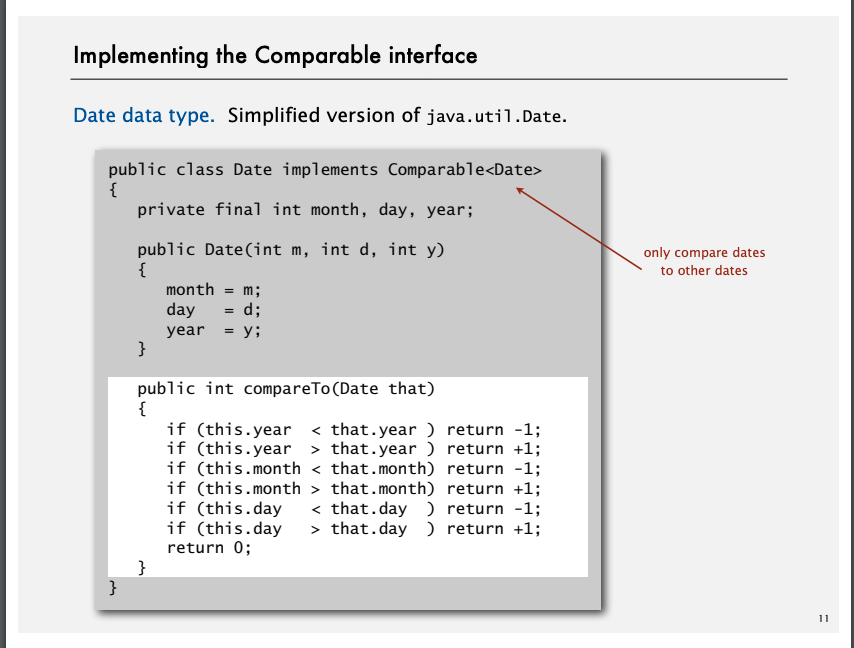

# Sort

### Goal sort any type of data 
* sort random real numbers in ascending order
* sort string
* sort files

### How can we achive those things in One Sort function
* Callback

Sort method doesn't depend on the type of object it handles by comparable interface

### Total (全順序)
* 反対称性
* 推移性
* 完全性

自分が小さければ -1 を返す

