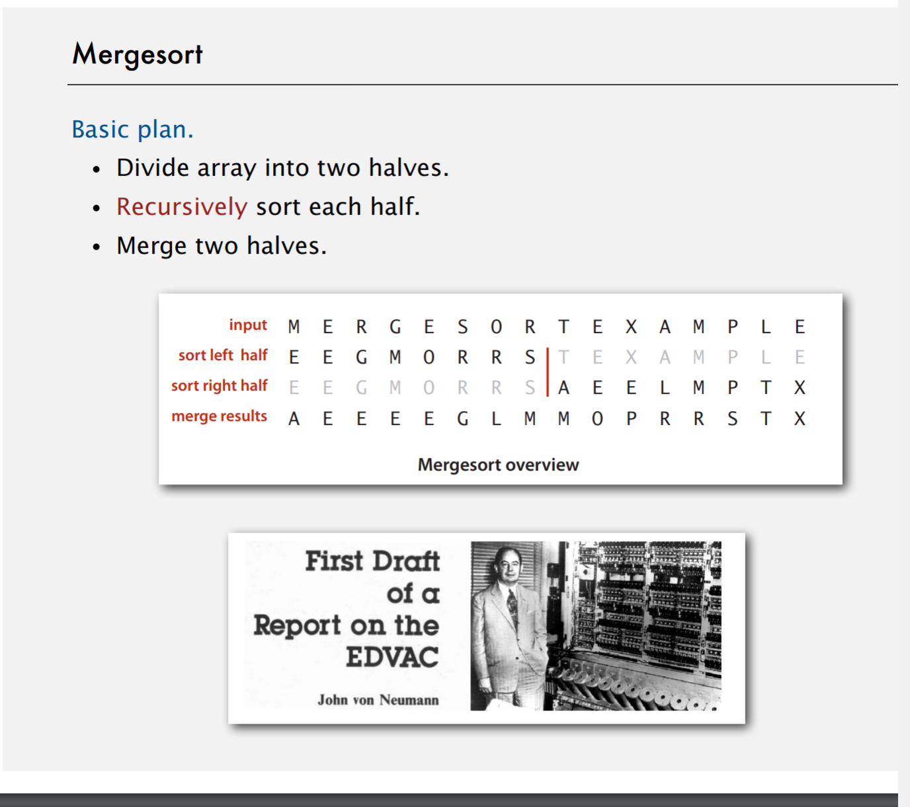
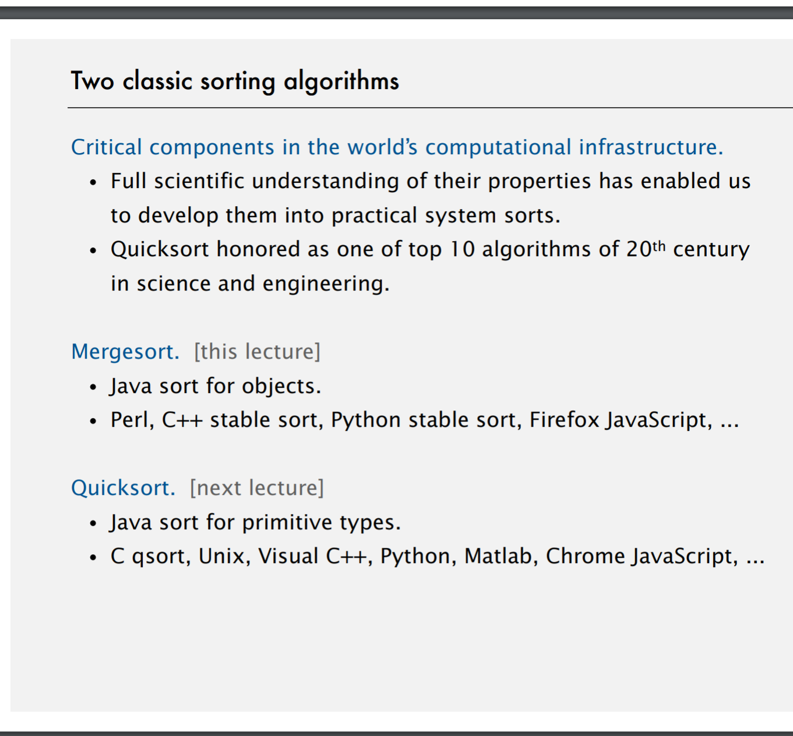
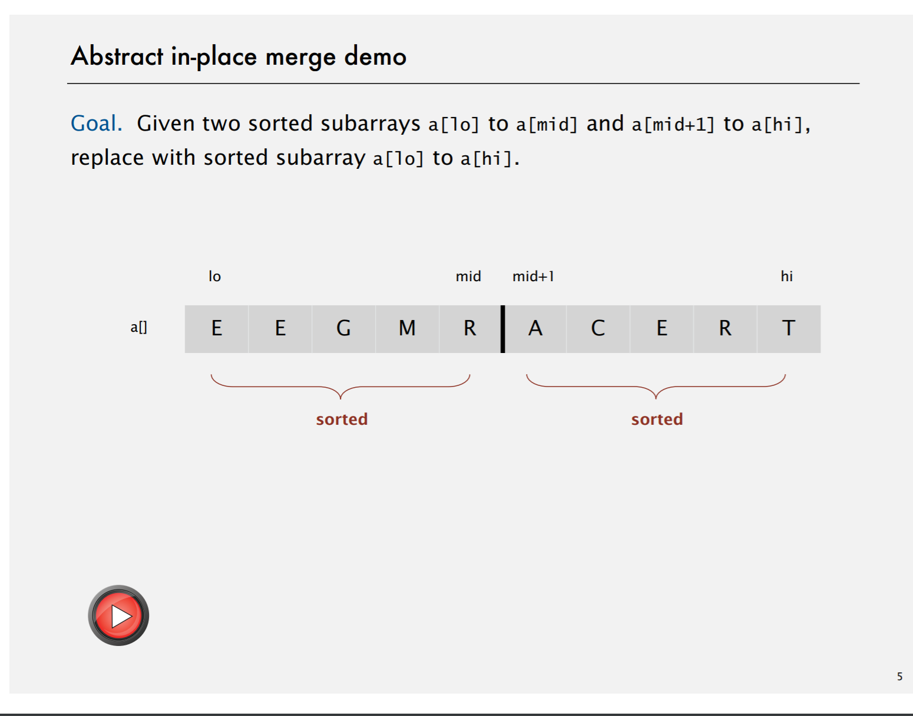
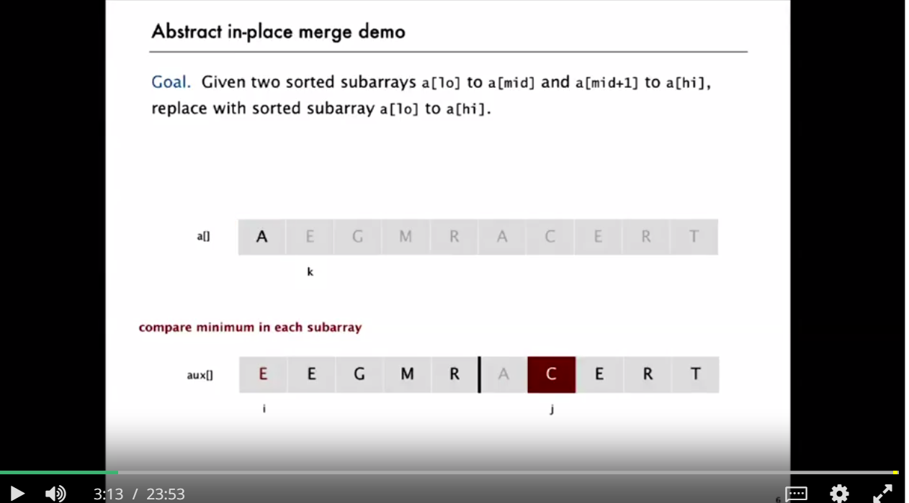
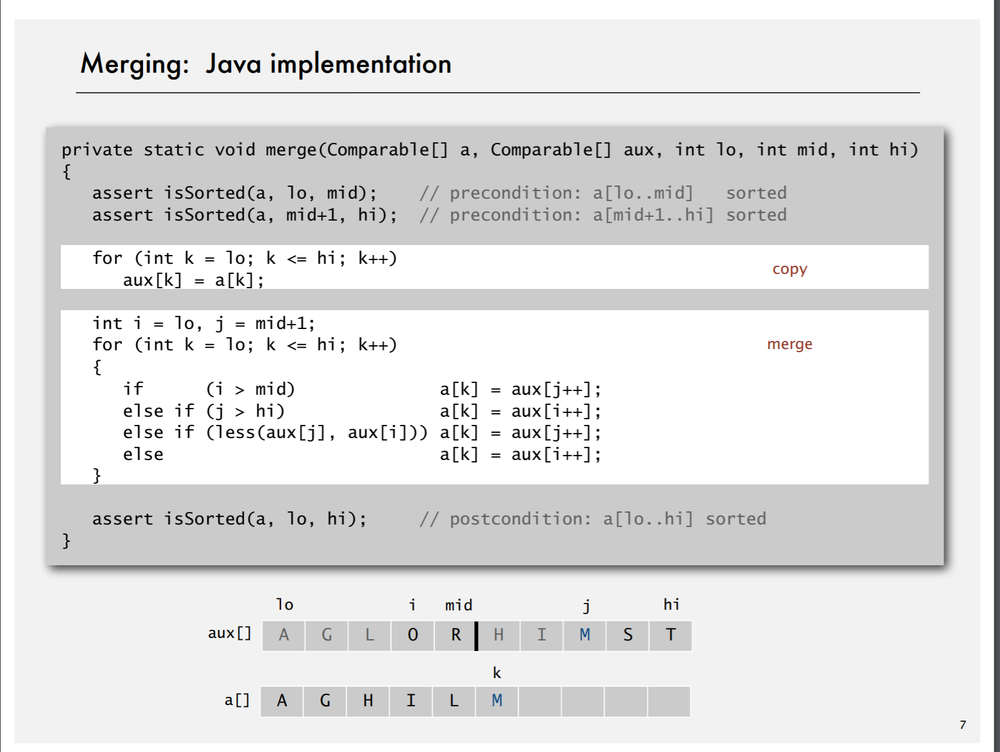
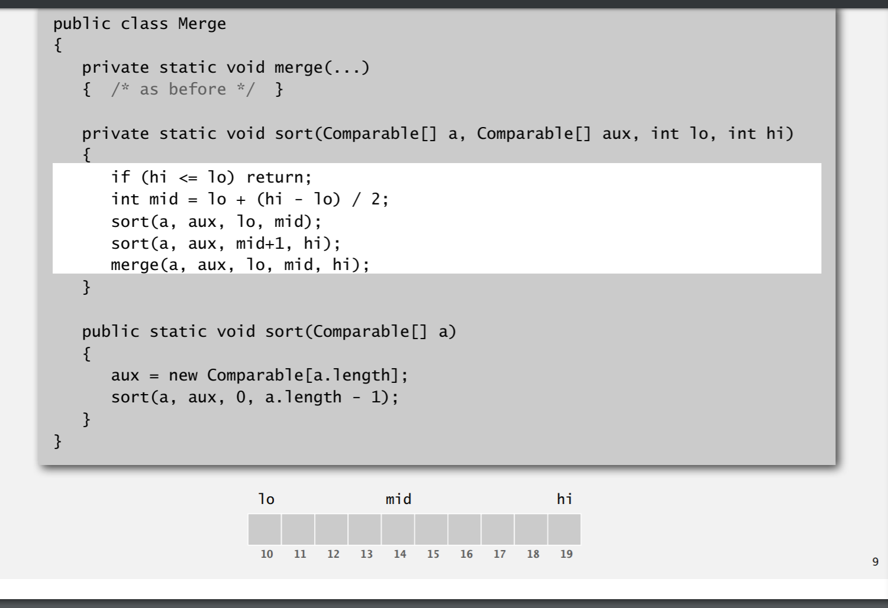
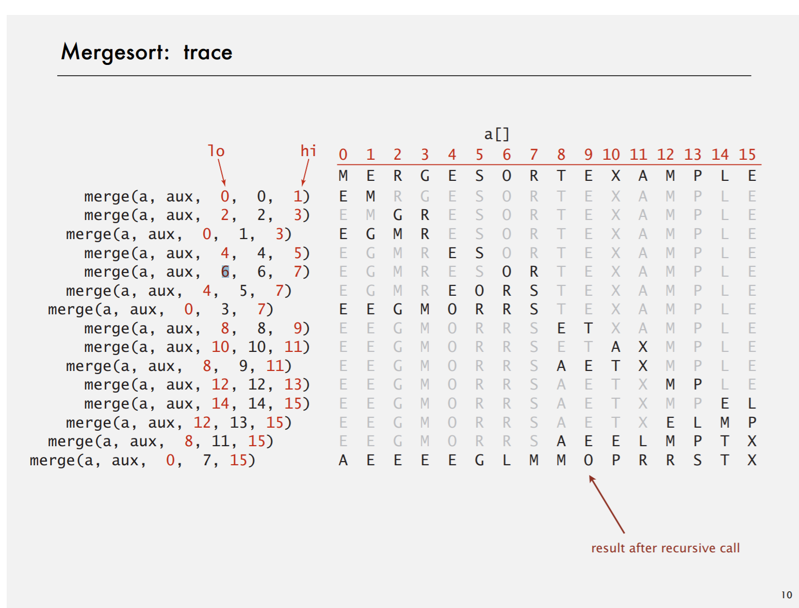

# Merge Sort
二つのソートされた配列を組み合わせて一つのソートされた配列を作る。　　
* これをするためには再帰的にしていく必要があるよ
* 二つに分けて、結果をmergeする
* 悪いところは余分に N space いるってところ　（N^2）

## なぜエクストラの配列がいるのか

## なぜobject で使われているのか？

[Demo](https://www.youtube.com/watch?v=XaqR3G_NVoo)
[Demo2](https://visualgo.net/bn/sorting)
[Demo3](https://www.youtube.com/watch?v=ZRPoEKHXTJg)

1.Goal 分割したarrayの中身が分割されていること

2. Array をコピーして元のarray の先頭のindex とコピーしたほうの分割したarray の先頭のindex を保持しておく

実際のロジック
* エキストラの配列に移す　そして本体に戻していく作業をする
* 四つの条件
	1. 左端が真ん中を超える
	2. 右端が端までいく
	3. 左と右を比べ左が小さい
	4. 左を右を比べて左が多きい
		

* Assertion のはなし
	* Helps detect logic bugs
	* Documents code
	* InVariation にええよってはなし

* Extra Arrayが再起関数の外側にあるのが特徴

+ Trace
