# Union Find
[参照PDF](http://www.albertstam.com/Algorithms.pdf)

[UNION Find Atcoer](https://www.slideshare.net/chokudai/union-find-49066733)
## はじめに　　

* いいアルゴリズは大きな差を生む
* 良いコードをシンプルにかける
* 計算量がわかれば比較ができるよ
* 最初はナイーブなアプローチを

## 問題定義
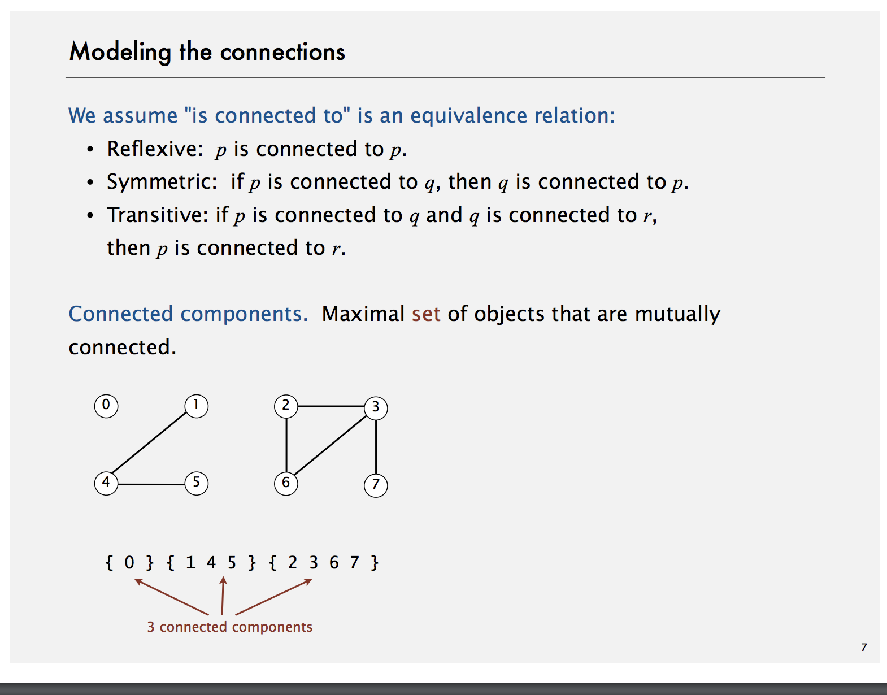
[link](https://youtu.be/gfSpPbJWzVs?list=PLRdD1c6QbAqJn0606RlOR6T3yUqFWKwmX&t=157)
[参照リンク](
https://algs4.cs.princeton.edu/15uf/)


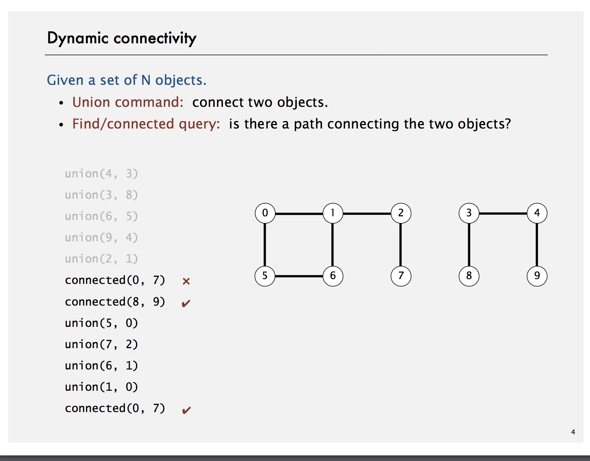
## ゴール

数値の組みが同値関であるかどうか判定する効率的なアルゴリズムを書きたい。

## アプリケーション

* ネットワーク　（数値がコンピュータを表してる）
* SNS　での友達判定
* 同じ集合かどうか（数学）

## API の定義

```
public class UF
	UF(int n)
	void union(int p, int q) // qとpが繋がりを追加
	int find(int p)
	boolean connected(int p, int q) pとqが同値関係か判定するよ
	int count()
```

## その１　Quick-Find

* id[p] id[q] が同じかどうかみる
* union するときは　同じやつをすべて変える

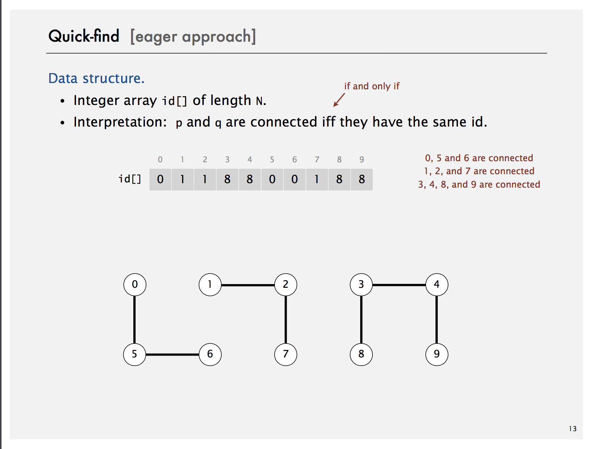
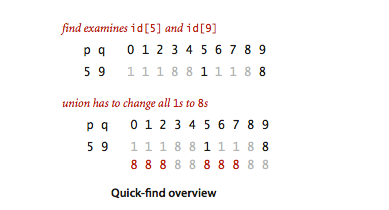

[demo](https://www.youtube.com/watch?v=4gEaaTRz1h8)

一緒に実装してみよう

### Performance

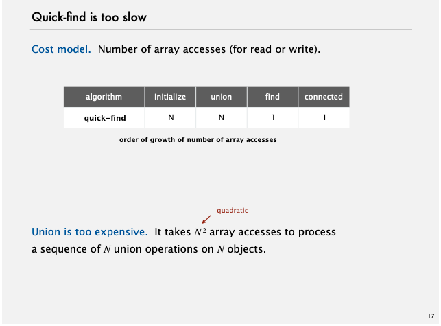


## その2　Union-Find

+ union がおせえ
* id[p]が親の参照をもつようにしよう（つまり木構造にしてしまおう）

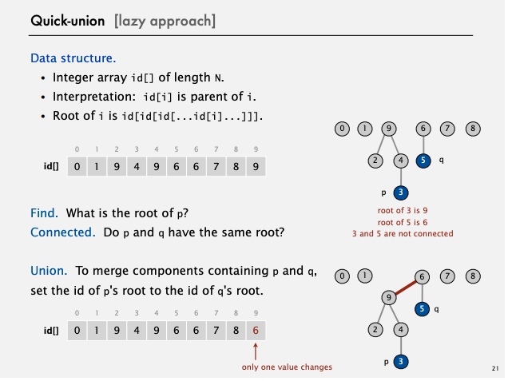

[demo](https://youtu.be/BcRLmCS8pfw?list=PLaLOVNqqD-2Hz-wATEaLxBGsZcdcDzMBw&t=179)
親の参照だけ変えれば良い
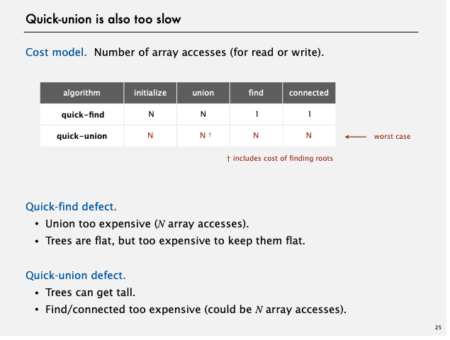


## その3 Weighted-Union

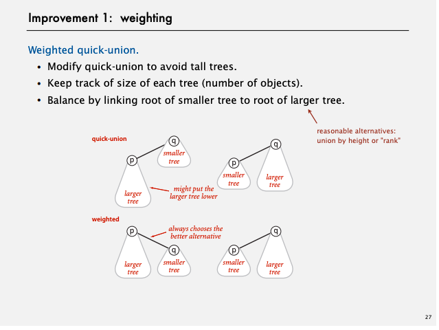
[Demo](https://youtu.be/Wme8SDUaBx8?list=PLaLOVNqqD-2Hz-wATEaLxBGsZcdcDzMBw&t=93)

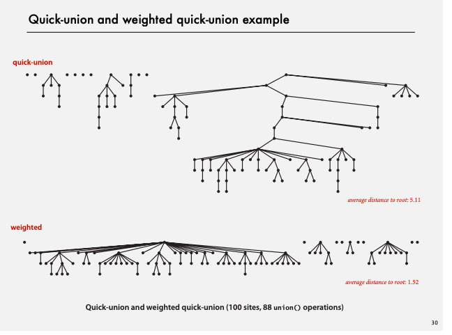

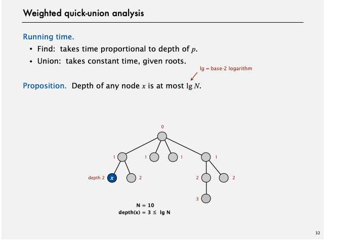
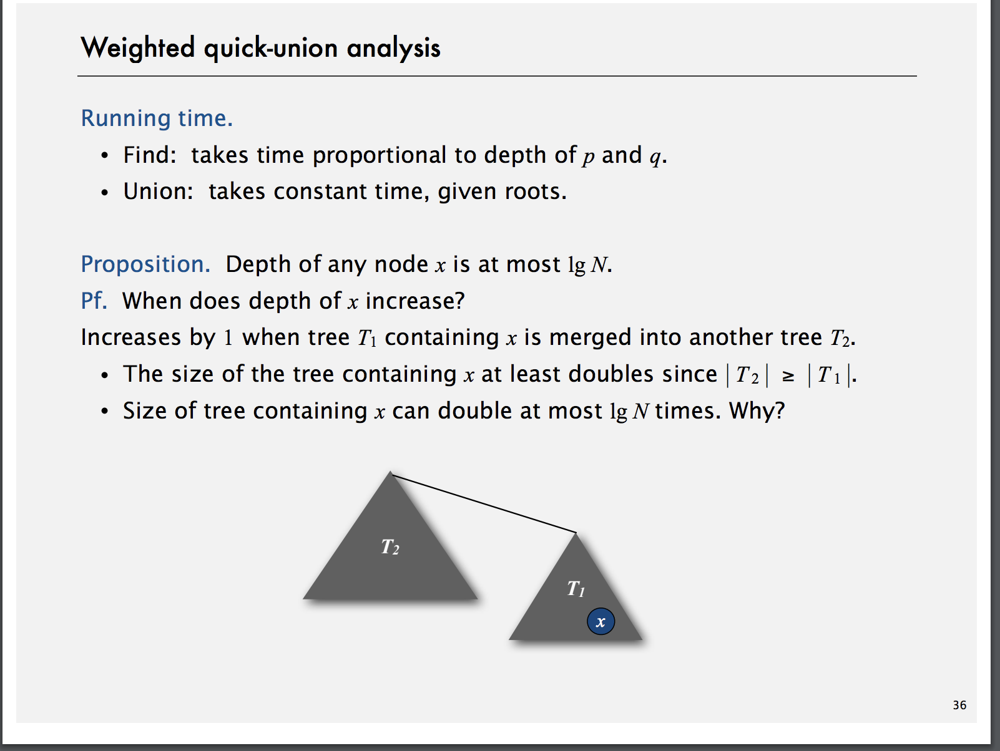
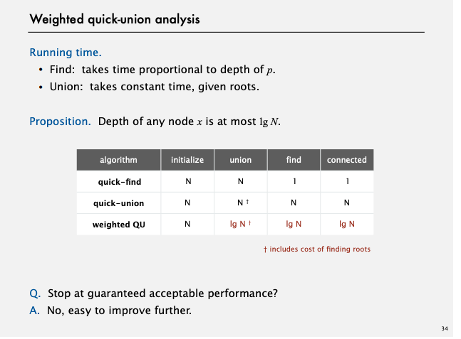
* 余力があれば証明
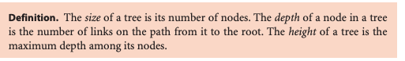
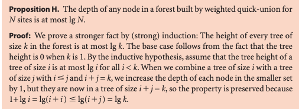
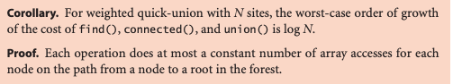

* 改善 その2
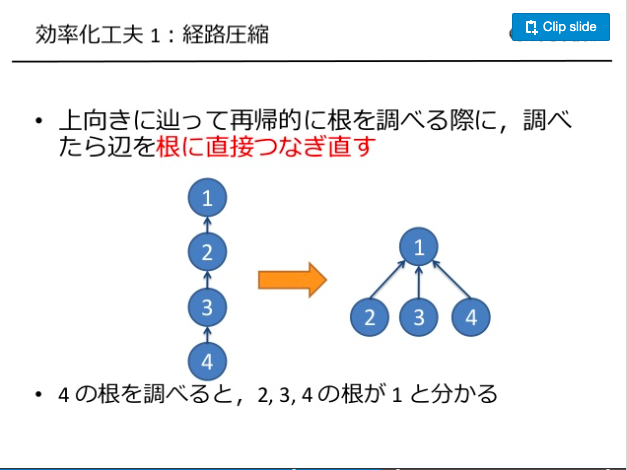
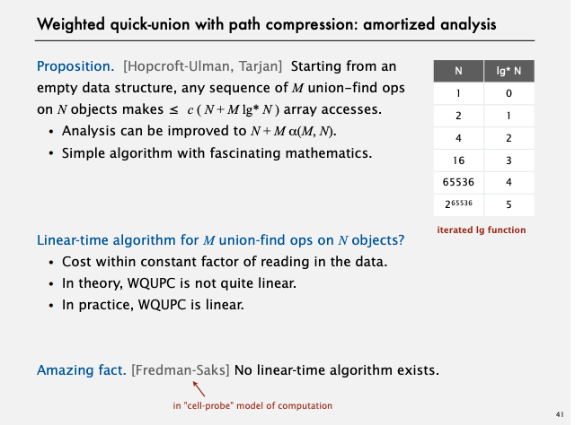

## まとめ

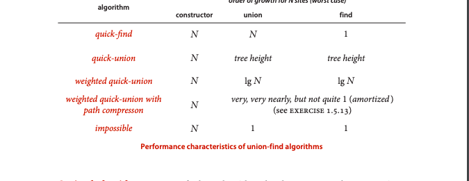
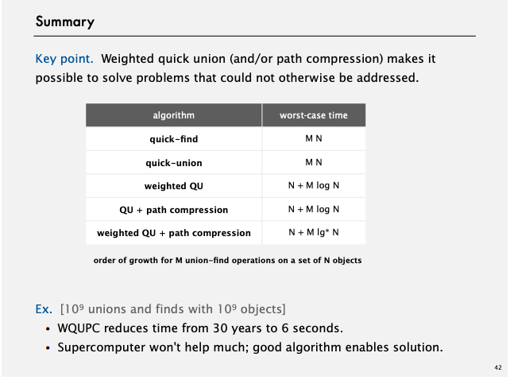


(Atcorder 問題)(https://www.hamayanhamayan.com/entry/2017/10/04/101826)