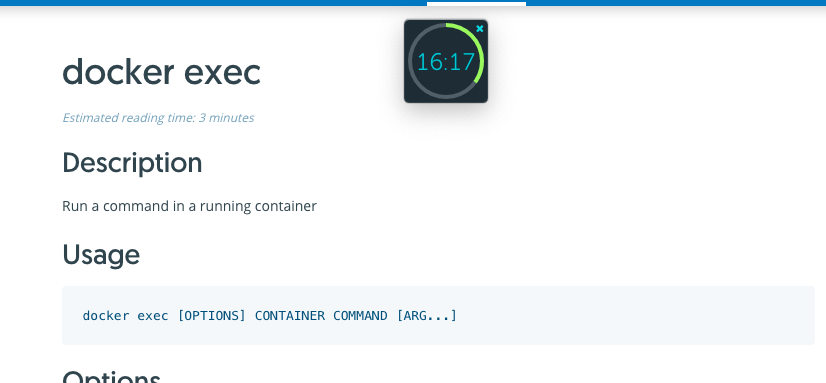
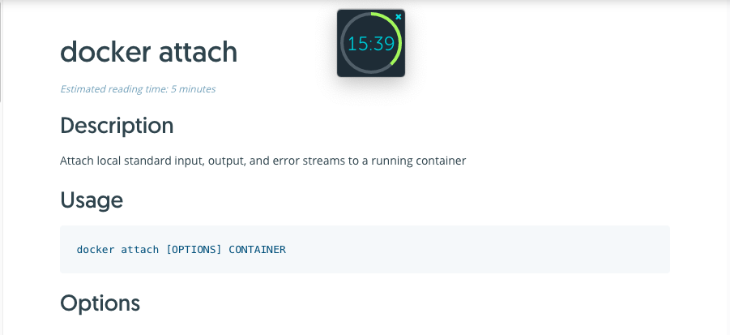

# Docker
```docker
	docker exe -it [name] bash
```


```docker
	docker attache -it [name] bash
```


# the difference between attach vs exec
https://stackoverflow.com/questions/30960686/difference-between-docker-attach-and-docker-exec
docker >= 1.3) If we use docker attach, we can use only one instance of shell.
So if we want to open new terminal with new instance of container's shell, we just need to run docker exec

if the docker container was started using /bin/bash command, you can access it using attach, if not then you need to execute the command to create a bash instance inside the container using exec.