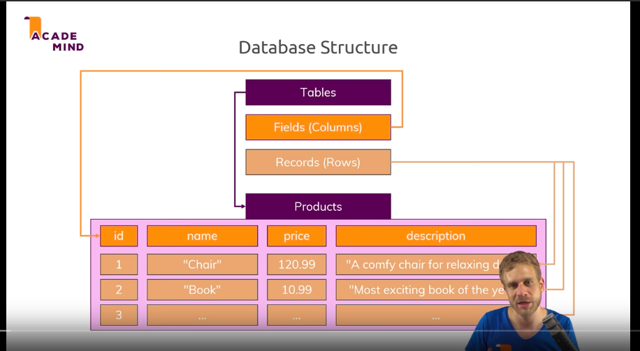
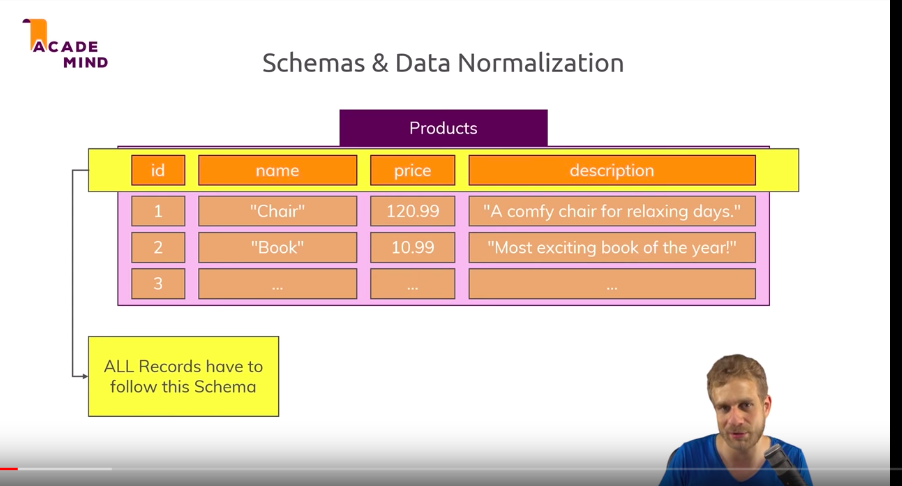
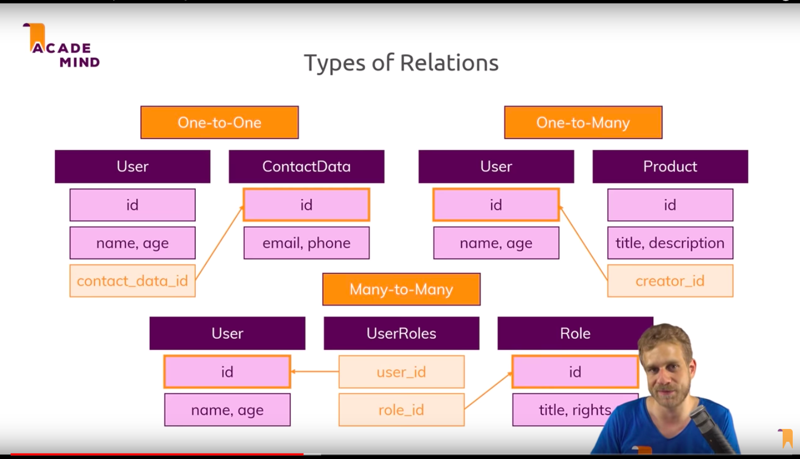
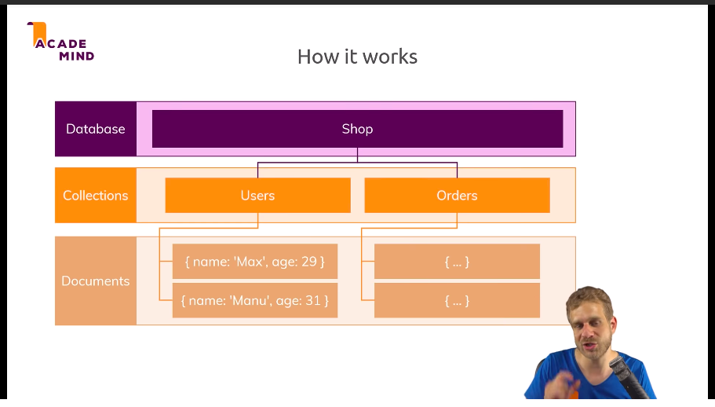
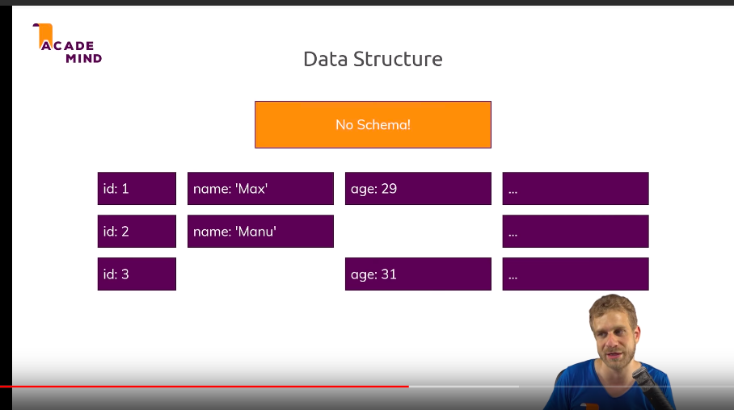
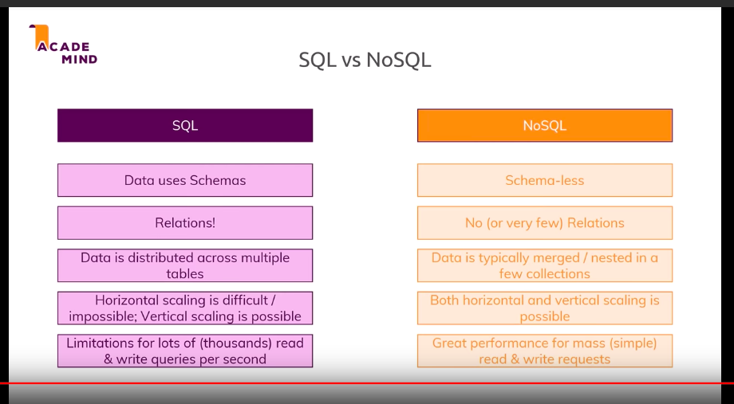

# SQL vs NoSQL

## SQL is structure query language

### DataBase Structure

### All record have to follow schema

### Relations

### Types Of Relations!

## NoSQL
It can store a lot of data  

There is no schea each document could have different document

No schema

* Key-Value Stores:
* Document Databases

Compare these two
* Sql schema has to be desideid if you want to change the field you need to do migations  
No Sql is dynamic you can just change them

* SQL has squl which is very poworful to filter or select

* SQL Scale vritically

## Use SQL 
* ACID
* No changing ans structured

## NO SQL 
* a lot of data ans not stocutred
* cloud base store raoge
+ rapid development	to update data base structure alot