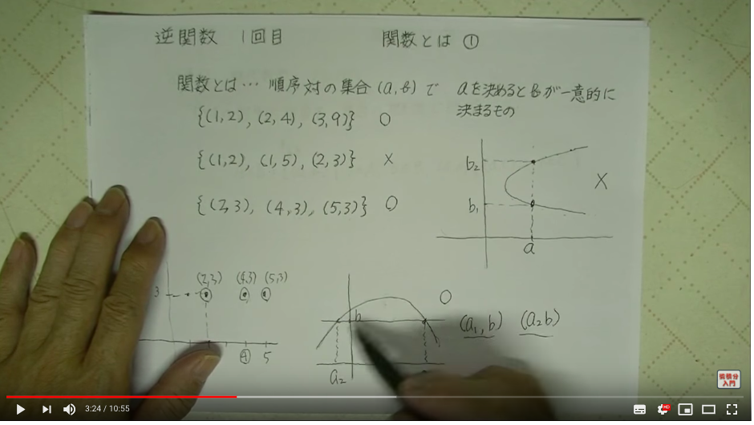
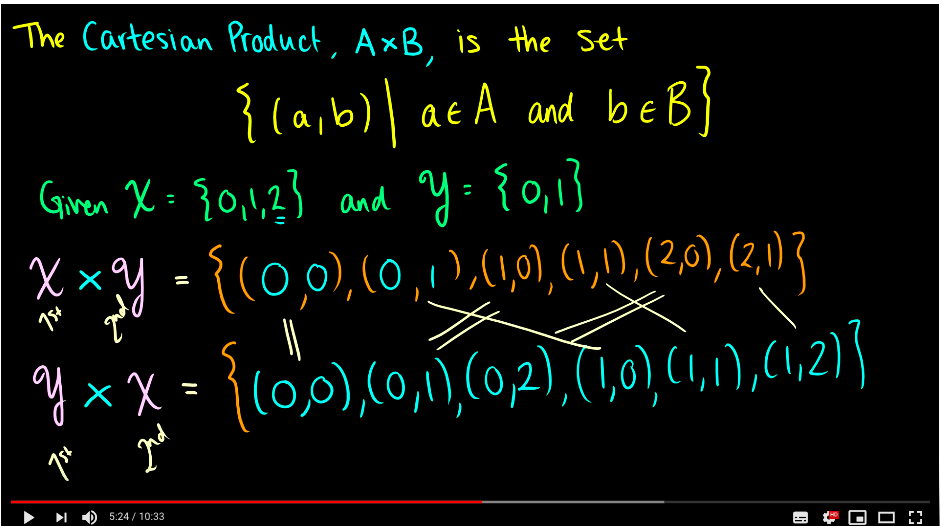
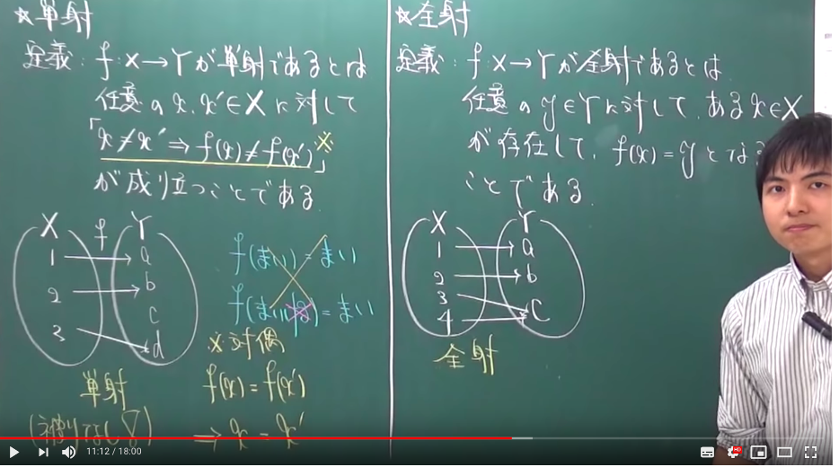
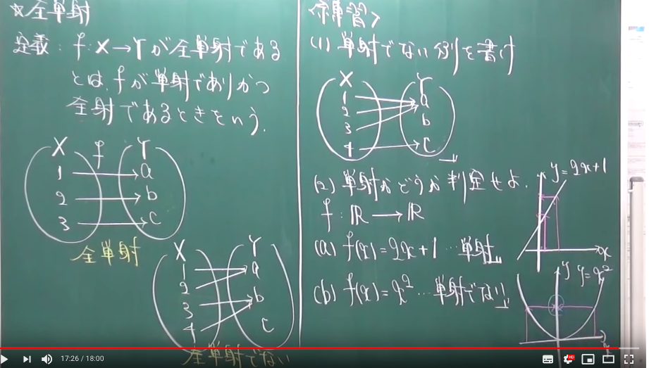
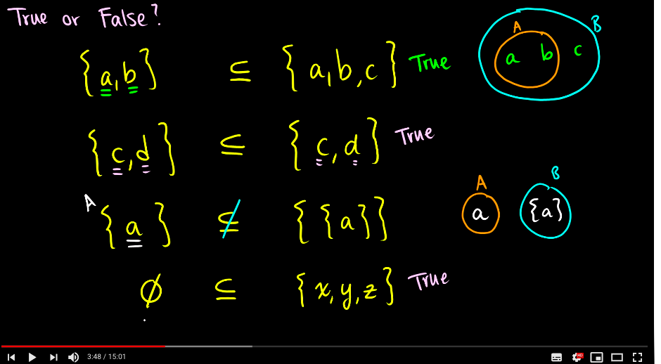

# Memo and Question

1. 実関数と複素関数とは何だろう
   1. 実数値関数（じっすうちかんすう、英: real-valued function）、あるいは実関数（じつかんすう、英: real function）とは、値として実数を与える関数をいう。 つまり、定義域のそれぞれの元に対し実数を割り当てる関数のことである。

2. 順序対とは何だろう再度定義の確認
   1. 
   2. 対集合には順序の概念があるというこ
   3. 直積とは　二つの集合の全ての部分集合を集めたもの
   4. 
3. xに対応するyは一意に定まる。　同じの入れたら同じのに飛びということ　x-> 1 y -> a, bとかはダメ
4. 単射はxを飛ばしたyはx2と同じにならないということ
5. 全単射は両方満たしているよとうことですなあ
6. 
7. 
8. 部分集合の話　自分のメモ用   
9.  
10. y = f(x)と書くことも出来るこれを使ったら名前のない関数を定義することが出来るよ プログラムでは利点を感じるよ
    1. 関数と同じ意味で写像という言葉をつかうこともある。
11. 関数の合成は結合法則は満たすが、交換法則は満たさない。
    1. > $$(g \circ f)(x) != (f\circ g)(x)$$
    2. 二つの関数を合成するためには(中間の集合)が同じでなければならない。。意味わからん
    3. その他続いていくんですけど、僕にはわからん
12. 任意の　$y \in Y$に入ってくる矢印はたかだか一本である
    1. 単射はxを飛ばしたyはx2と同じにならないということ
13. 上への関数では任意の　y \in Yに少なくとも一本の矢印が入ってくる
    1. 全射はすべてのyにたいしてxが存在しているということ
14. $y \in Y$にちょうど一本入ってくる
15. 全単射にもあるけど、あんまり使わないのでここでは扱わない
    1. 全単射が一番大事として扱うよ　X, Y集合の現個数わかるからね 