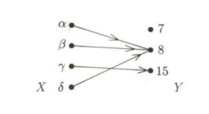
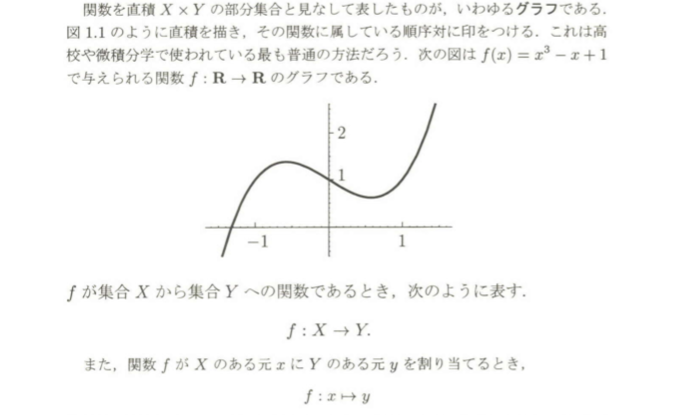
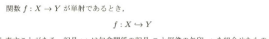

# 基礎的な準備

## 1.4 関数

関数とは数学における基礎的な概念の一つである。しかし、微分学が発明された頃は、実関数や複素関数のみが対象となっており、

$$ f(x) = x^2 + 4$$
$$ f(x) = \sqrt{sin(x/\pi)} $$
$$f(x) = \int_0^x (sin t)/tdt$$
$$f(x) = \int_0^x (sin t)/tdt$$
$$f(x) = \sum_{n=0} (x^n/n!)$$
の様に適当な式で表現できるものこそが関数と思われていた。
しかし今日の考え方では、実関数とは任意の実数を割り当てたものと捉えそれ以上の制約はない。

XとYを任意の集合とする。直観的には,関数f(x)とはXの各元にyの元を1つだけ割り当てる「何か」である。関数を図で示すには、集合$X$と$Y$を描き、$X$の各元$x \in X$ からそれに割り当てられる$y\in Y$に矢印を引く。$X$からの矢印はそれぞれの元に対して一本づつだが、Yに入ってくる矢印は一本でも、複数本でも良い。集合と順序対で関数を定義してみよう。

### 1.4.1 定義

> 集合$X$から集合$Y$への関数$f$とは, $x\in X$と $y \in Y $の順序対 $(x,y)$の集合 (つまり,直積$X × Y$の部分集合)で,任意の$x \in X$ に対して, $x$を第1成分とする順序対を唯一含むものである。

もちろん、$f$の中の順序対$(x ,y)$は元χに元yを割り当てることを意味しているにすぎない。このとき、$y = f_(x)$と書き、$f$はxをyにうつす。または, yはxの像であるという。

関数を直積 $X \times Y$の部分集合とみなして表したものがいわゆるグラフである。 

 **Memo10**

### 1.4.2 関数の合成

$f: X \to Y$ と $g: Y \to Z$が関数ならば、任意の$x \in X$に対して、
> $$h(x)= g(f(x))$$

と定義することで、新たな関数 $f: X \to Z$を定義できる。関数 gとfの合成関数という。
> $$(g \circ f)(x) = g(f(x))$$

**Memo** 11

### 1.4.3 (重要な特別な関数)
関数 $f: X \to Y$ はそれが満たす条件に応じて、次のように呼ばれる。
* **単射**(1対1 の関数) $x \neq x$'ならば $f(x) \neq f(x')$となる関数   (**memo12**)
* **全射**(上へのの関数) 任意の$y \in Y$ に対して、 $f(x)= y$となる$x \in X$ が存在する関数  (**memo13**)
* **全単射**(1対1対応) 1対1の関数であり、かつ、上への関数であるもの (**memo14**)

単射をこのように表記することも出来る
 **Memo15**

#### 逆関数
$f: X \to Y$が1対1対応であるとき(全単射)、 $y = f(x)$を満たすXの唯一の元$x$に対して$g(y) = x$を定めることで、関数$g:Y \to X$が定義できる。
この$g$を$f$の逆関数といい、通常$f ^{-1}$と表す。 