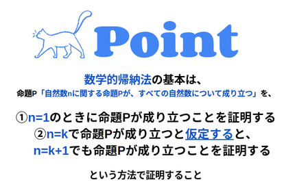
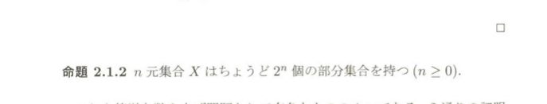
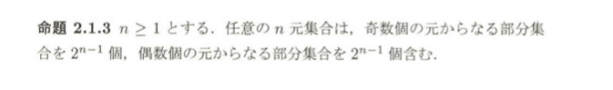
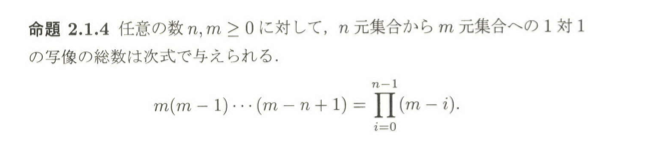

 # 組み合わせ的数え上げ

## 2.1 関数と部分集合

### 問題.5文字からなる単語はいくつあるか

5文字の単語は,集合 { 1,2,...,5 }から文字の集合{a,b...,z}への写像に対応すると解釈することができる.数え上げの問題をこのように単純な問題に置き換えるといのは,数え上げの分野における基本的な技術の1つである.

### 2.1.1 命題

$$Nをn元集合(空集合でもよい.つまり,n = 0,1,2...)とし,Mをm元集合で,\\
m \geqq 1とする.この時 写像 f: N \to Mの総数は m^nである.$$

#### 事前準備
1. 数学的帰納法　進め方
	
2. 写像の定義
   1. 集合$X$から集合$Y$への関数$f$とは, $x\in X$と $y \in Y $の順序対 $(x,y)$の集合 (つまり,直積$X × Y$の部分集合)で,任意の$x \in X$ に対して, $x$を第1成分とする順序対を唯一含むものである

<!-- #### 考察
1. $n = 0$ のとき, この場合集合 $N = \emptyset$ からある集合 $M$へのすべての写像を考える.
2. 写像の定義より,そのような写像 $f$は $x \in N = \emptyset$ と $y \in M$の順序対$(x, y)$からなる集合である.
3. 空集合には要素が存在しないので,$f$はそのような順序対を含まない.
4. したがって,唯一の可能性として,$f$は空集合となる(順序対を全く含まない)
5. この場合にも,$f = $は $\emptyset$は写像の定義を満たしている.
6. 定義には, 任意の$x \in N$に対しての,満たすべき条件が挙げられているわけだが,その$x \in N$ が存在しないのだから何の問題もない
7. したがって丁度　1つの写像f: \emptyset \to Mが存在する. -->

### 2.1.2 命題

### 2.1.3 命題

...

### 2.1.4 命題

