# 組み合わせ的数え上げ

## 2.3 二項係数

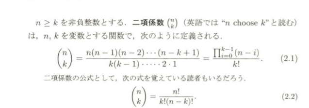

二項係数 $n\choose k$ の基本的な組み合わせ論的な意味は、$n元集合のk部分集合全体の総数である$

## 定義 2.3.1 

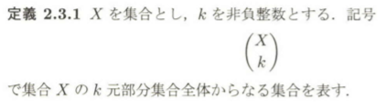

## 定義 2.3.2

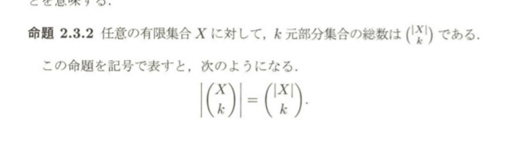

### 二項係数があらわれる基本的な問題

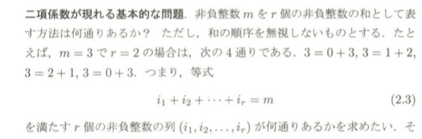

### 二項係数の簡単な性質

1. 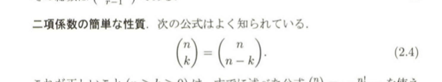
2. 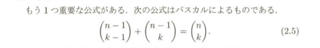

パスカルの三角形
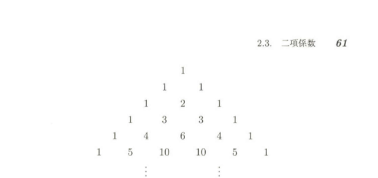

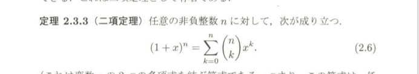

### 2.3.3 二項定理

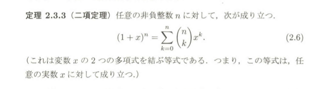

### 2.1.3 の別証

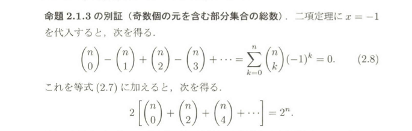

### 2.3.4 命題
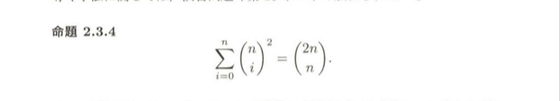

### 多項係数と多項定理

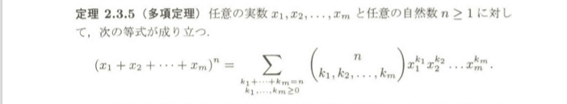